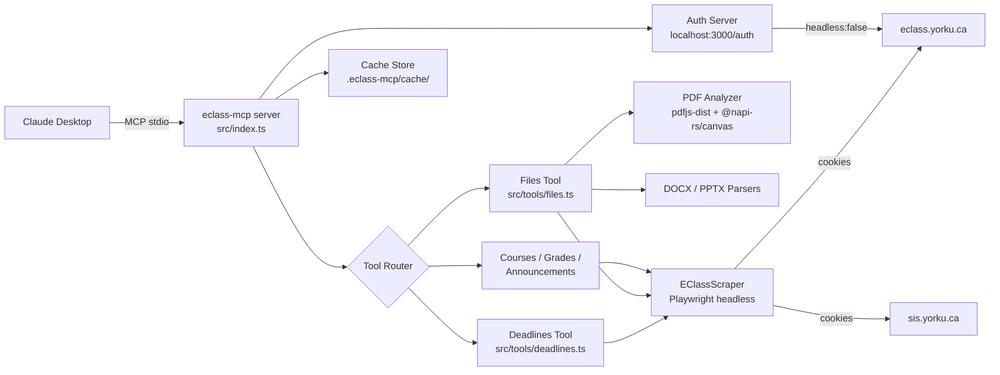

# 🎓 eClass MCP

> **Connect Claude to York University's eClass — assignments, deadlines, grades, and course files, right inside your AI assistant.**

> **Current engine stage:** `1.0.0-beta.1`
>
> The engine versioning and release policy now lives in [`docs/PROJECT_MASTER.md`](docs/PROJECT_MASTER.md#engine-versioning--release-policy). The historical core-only release is treated as `0.9.0-core`, and the engine line is versioned separately from the eventual product surfaces.

[](https://nodejs.org/)
[](https://www.typescriptlang.org/)
[](https://modelcontextprotocol.io/)
[](https://playwright.dev/)

---

## 🤔 What this is / What this is not

| ✅ This IS                                                                    | ❌ This is NOT                                               |
| ----------------------------------------------------------------------------- | ------------------------------------------------------------ |
| A local MCP server that lets Claude read your eClass data                     | A public API or cloud service                                |
| A scraping layer using your own authenticated session                         | A way to bypass any security or act on behalf of other users |
| A tool for students to get faster, AI-assisted access to their own coursework | A replacement for the eClass website                         |
| Entirely local — your session and data never leave your machine               | Affiliated with or endorsed by York University               |

---

## ✨ Features at a Glance

- 📅 **Smart Deadlines** — upcoming, month-by-month, and arbitrary date ranges
- 📄 **PDF Intelligence** — hybrid text + vision extraction (text pages stay cheap; image pages render at 100 DPI)
- 🔍 **Assignment Deep-Dive** — instructions, submission status, and grades for any assignment or quiz URL
- 🏆 **Grades** — per-course or overview grade reports
- 📣 **Announcements** — course news and forum posts
- 🗂️ **Course Content** — file/resource listings per course section
- 🎓 **SIS Integration** — personal exam schedules and class timetables (lectures, labs, tutorials)
- 🔐 **Session Auth** — one-click login via a local browser window; session bridging for both eClass and SIS domains
- 💾 **Smart Caching** — tiered file-based JSON cache with versioned schemas (Hot 30m, Warm 20m, Course 3h, Stable 48h)
- 📝 **Cache Transparency** — every tool returns an `_cache` object representing data freshness (hit/miss, fetched_at, expires_at)
- 🧹 **Granular Invalidation** — manual `clear_cache` clears **default** TTL cache only; **user-pinned** entries stay until you `cache_delete_pinned` or `cache_unpin`; automatic volatile clearing on re-auth
- 📌 **Pinned cache (T27)** — pin files, section text, or course content to keep past TTL; on-disk quota via `ECLASS_MCP_PIN_QUOTA_BYTES` (default 300 MiB)

### Tool output contracts (E11)

Tool responses are validated with **Zod** before serialization (`src/tools/eclass-contracts.ts`, `src/tools/mcp-validated-response.ts`). By default validation is **non-fatal**: `safeParse` runs, unknown/extra keys are allowed via `.passthrough()`, and on mismatch the server logs a warning and still returns the payload JSON. Set **`ECLASS_MCP_STRICT_TOOL_OUTPUT=1`** in `.env` only when you want validation to throw (local debugging). Cengage tools keep their own schema boundary in `src/tools/cengage/responses.ts`.

### Structured error codes (E12, phased)

Machine-readable **`code`** values (e.g. `SESSION_EXPIRED`, `SCRAPE_LAYOUT_CHANGED`, `VALIDATION_FAILED`) are defined in `src/errors/codes.ts`. Helpers in `src/errors/tool-error.ts` build consistent JSON alongside existing `message` / `status` fields. Schemas in `eclass-contracts.ts` allow **optional** `code` so older payloads still validate; tools gain `code` incrementally by phase. Scraper layout drift uses `ScrapeLayoutError` in `src/scraper/scrape-errors.ts` (returned as JSON from `get_file_text` when a file download wrapper cannot be resolved).

### Logging (E14)

Structured **JSON logs** go to **stderr** (stdout stays clean for MCP stdio). Each tool call gets a **`requestId`** and **`tool`** name via `runWithToolContext` in `src/index.ts`. Set **`ECLASS_MCP_LOG_LEVEL`** (`trace` … `silent`, default `info`) to control verbosity. Details: [`docs/logging.md`](docs/logging.md).

---

## 🏗️ Architecture



---

## 🛠️ MCP Tools — Quick Reference

| Tool                      | Purpose                                                                                                | Key Parameters                                                                                                                                                    |
| ------------------------- | ------------------------------------------------------------------------------------------------------ | ----------------------------------------------------------------------------------------------------------------------------------------------------------------- |
| `list_courses`            | List enrolled courses                                                                                  | —                                                                                                                                                                 |
| `get_course_content`      | Sections, files, assignments for one course                                                            | `courseId`                                                                                                                                                        |
| `get_section_text`        | Section page text, links, and tabbed content                                                           | `url`                                                                                                                                                             |
| `get_upcoming_deadlines`  | Assignments due in the next N days                                                                     | `daysAhead?`, `courseId?`                                                                                                                                         |
| `get_deadlines`           | Deadlines by scope: upcoming / month / range                                                           | `scope`, `month?`, `year?`, `from?`, `to?`, `includeDetails?`, `maxDetails?`                                                                                      |
| `get_item_details`        | Full instructions + status + grade for one assignment or quiz URL                                      | `url`, `includeImages?`, `maxImages?`, `imageOffset?`, `maxTotalImageBytes?`, `includeCsv?`, `csvMode?`, `maxCsvBytes?`, `csvPreviewLines?`, `maxCsvAttachments?` |
| `get_file_text`           | Extract text (and rendered images) from PDF, DOCX, or PPTX                                             | `courseId`, `fileUrl`, `startPage?`, `endPage?`                                                                                                                   |
| `get_grades`              | Grade report (all courses or one)                                                                      | `courseId?`                                                                                                                                                       |
| `get_announcements`       | Recent course announcements                                                                            | `courseId?`, `limit?`                                                                                                                                             |
| `get_exam_schedule`       | List your upcoming personal exam schedule from York SIS                                                | —                                                                                                                                                                 |
| `get_class_timetable`     | List your personal class timetable (lectures/labs) from York SIS                                       | —                                                                                                                                                                 |
| `search_professors`       | Finds professor profiles on RateMyProfessors                                                           | `name`, `campus?`                                                                                                                                                 |
| `get_professor_details`   | Fetches detailed ratings, difficulty, and comments for a professor                                     | `teacherId`                                                                                                                                                       |
| `discover_cengage_links`  | Detect and classify Cengage/WebAssign links from pasted text or extracted content                      | `text`, `source?`, `courseId?`, `sectionUrl?`, `sourceFile?`                                                                                                      |
| `list_cengage_courses`    | List Cengage/WebAssign courses from saved-session dashboard flow (optional link fallback)              | `entryUrl?`, `discoveredLink?`, `courseQuery?`                                                                                                                    |
| `get_cengage_assignments` | Fetch Cengage/WebAssign assignments from saved-session dashboard flow with bounded aggregation support | `courseId?`, `courseKey?`, `courseQuery?`, `allCourses?`, `maxCourses?`, `maxAssignmentsPerCourse?`, `entryUrl?`, `ssoUrl?` (legacy)                              |
| `get_cengage_assignment_details` | Fetch question-level Cengage/WebAssign assignment details with prompt sections, asset inventory, rendered-media fallback metadata, and scoring hints | `assignmentUrl?`, `assignmentId?`, `assignmentQuery?`, `courseId?`, `courseKey?`, `courseQuery?`, `includeAnswers?`, `includeResources?`, `includeAssetInventory?`, `includeRenderedMedia?`, `maxQuestions?`, `maxQuestionTextChars?`, `maxAnswerTextChars?` |
| `clear_cache`             | Clears **non-pinned** cache by scope (`all`, `volatile`, `deadlines`, …); pins are **not** removed     | `scope?`                                                                                                                                                          |
| `cache_pin`               | Pin a resource already in cache (kept past TTL until unpinned)                                         | `resource_type`, `fileUrl?` / `url?` / `courseId?`, `note?`                                                                                                       |
| `cache_unpin`             | Remove pin metadata without deleting cache files                                                       | `pinId`                                                                                                                                                           |
| `cache_list_pins`         | List pins and quota usage                                                                              | `resource_type?`                                                                                                                                                  |
| `cache_refresh_pin`       | Re-fetch and refresh cached data for a pin                                                             | `pinId`                                                                                                                                                           |
| `cache_delete_pinned`     | Delete pinned cache files and registry entries (explicit)                                              | `pinId` or `mode` + `resource_type?`                                                                                                                              |

### User-pinned cache semantics

1. **Fetch first** — call `get_file_text`, `get_section_text`, or `get_course_content` so the entry exists under `.eclass-mcp/cache/`, then call `cache_pin` with the same identifiers.
2. **`clear_cache`** — removes only **default** TTL cache entries; **pinned** files are skipped. The tool response states that pins were unchanged.
3. **Removing pins** — `cache_unpin` drops the pin only; **`cache_delete_pinned`** deletes the on-disk cache file(s) and registry rows (use `pinId`, or `mode=all`, or `mode=by_type` + `resource_type`).
4. **Stale data** — pinned entries past TTL may still be served; JSON tools add `_cache.stale: true`; `get_file_text` prepends a short notice. Use `cache_refresh_pin` to refetch.
5. **Quota** — set `ECLASS_MCP_PIN_QUOTA_BYTES` in `.env` (bytes). Pinning fails with a structured `quota_exceeded` payload if the new pin would exceed the limit.

### Cengage and WebAssign workflow (dashboard-first default)

1. **Default workflow:** authenticate once via `/auth-cengage`, call `list_cengage_courses` without `entryUrl`, then call `get_cengage_assignments` with `courseQuery`, `courseId`, or `courseKey`.
2. **Aggregation workflow:** set `allCourses=true` in `get_cengage_assignments` to collect bounded summaries across dashboard courses (`maxCourses`, `maxAssignmentsPerCourse`).
3. **Details workflow:** after selecting an assignment, call `get_cengage_assignment_details` with `assignmentId`/`assignmentUrl`/`assignmentQuery` for question-level extraction and structured metadata.
4. **When enrollment links still matter:** use explicit `entryUrl` when the course is not yet visible in dashboard inventory (for example first-time enrollment wrappers) or when reproducing a specific launch path.
5. **Discovery role:** `discover_cengage_links` is bootstrap/fallback only; use it after dashboard-first calls cannot locate the needed course, then retry with discovered `entryUrl`/selection input.
6. **Compatibility path:** `get_cengage_assignments` and `get_cengage_assignment_details` still accept legacy `ssoUrl`; `entryUrl` remains the preferred explicit-link field.
7. **Selection behavior:** when multiple courses match, responses may return `status="needs_course_selection"`; provide `courseId`, `courseKey`, or `courseQuery` and retry.
8. **Auth behavior parity:** when Cengage session state is missing or stale, responses return `status="auth_required"` with retry guidance and a dynamic `authUrl`.
9. **Response contract:** Cengage tools follow structured status values (`ok`, `auth_required`, `needs_course_selection`, `no_data`, `error`) and include `_cache` freshness metadata.

> 📖 **Master plan (roadmaps, history, engine beta, engineering):** [docs/PROJECT_MASTER.md](docs/PROJECT_MASTER.md) · Deep-dive: [Deadlines](docs/tools/deadlines/roadmap.md) · [PDF pipeline](docs/tools/get_file_text/history.md)

---

### 🧪 Testing & Validation

For server-level validation (verifying raw JSON before putting it into a host like Claude):

1. Stop any running server instances.
2. Launch the [MCP Inspector](https://github.com/modelcontextprotocol/inspector):

   ```powershell
   npx.cmd @modelcontextprotocol/inspector node dist/index.js
   ```

3. Open `http://localhost:6274` in your browser.
4. Test individual tools and inspect JSON payloads.

If you are in PowerShell and `npm` / `npx` fail with an execution-policy error, use the `.cmd`
variants explicitly (`npm.cmd`, `npx.cmd`) or run the command through `cmd /c`.

_For formal E2E test runs, see the **[E2E Handbook](docs/t11-e2e-handbook.md)** and the **[E2E Run Log](docs/e2e-run-log.md)**._

---

## 🚀 Quick Start

### Prerequisites

- Node.js ≥ 18
- [Claude Desktop](https://claude.ai/download) (macOS or Windows)
- A York University eClass account

### 1 — Clone & Install

```bash
git clone https://github.com/YOUR_USERNAME/eclass-mcp.git
cd eclass-mcp
npm install
```

### 2 — Install Playwright's Chromium Browser

```bash
npx playwright install chromium
```

> ⚠️ This is required for scraping. If you see `ENOSPC`, free up disk space and retry.

### 3 — Configure Environment

```bash
cp .env.example .env
# .env defaults are fine for most users — no changes needed
```

### 4 — Build & Register with Claude Desktop

```bash
npm run setup
```

This compiles TypeScript and writes the MCP entry into your Claude Desktop config file automatically.

### 5 — Restart Claude Desktop

Right-click the tray icon → **Quit**, then relaunch.

### 6 — Authenticate

The first time Claude tries to use an eClass tool, you'll see:

> _"eClass session not found. Please visit <http://localhost:3000/auth>"_

Open that URL. A visible browser window opens — log in with your York credentials (including MFA if required). Once you land on the eClass dashboard, the session is saved automatically and the browser closes.

You're done. Ask Claude anything about your courses.

---

## 💬 Typical Usage

```
"What assignments do I have due this week?"
"Show me my deadlines for March 2026, including past ones."
"Get the full instructions and my submission status for this assignment:
  https://eclass.yorku.ca/mod/assign/view.php?id=XXXXX"
"Read the lecture slides from EECS 1028 — Week 5."
"What are my current grades in all courses?"
"Any recent announcements from my professors?"
"What are my upcoming exams?"
"What is my class schedule this week?"
"Find professor John Doe on RateMyProfessors."
"What do students say about the difficulty of John Doe's classes?"
"List my Cengage/WebAssign courses from my saved session."
"Get Cengage assignments for MATH 1014 using courseQuery."
"Get full question-level details for Cengage assignment 38902818 in courseKey WA-production-1606311."
"Get Cengage assignment summaries across all my courses (bounded mode)."
"If dashboard-first misses the course, find Cengage/WebAssign links in this syllabus text as fallback."
```

For large PDFs, Claude will automatically paginate:

```
"Read pages 10–20 of that lecture PDF."
```

For instruction screenshots embedded in assignments, you can enable vision:

```
"Read the full instructions from this assignment, including any screenshots."
Use `eclass:get_item_details` with includeImages=true if your client supports it.
```

For small CSV attachments, you can inline them as text:

```
"Read the CSV attachment data from this assignment."
Use `eclass:get_item_details` with includeCsv=true (csvMode=full or preview).
```

---

## 🔧 Troubleshooting

### 🔑 Authentication / Session

| Symptom                       | Fix                                                                       |
| ----------------------------- | ------------------------------------------------------------------------- |
| `"eClass session expired"`    | Visit `http://localhost:3000/auth` and log in again                       |
| Session expires too fast      | Session TTL is 60 hours — this is intentional (York sessions expire ~72h) |
| Login window doesn't open     | Navigate to `http://localhost:3000/auth` manually in your browser         |
| Login page loops or redirects | Clear your browser cookies for `eclass.yorku.ca` and try again            |

### 🎭 Playwright Browser

| Symptom                                        | Fix                                                       |
| ---------------------------------------------- | --------------------------------------------------------- |
| `browserType.launch: Executable doesn't exist` | Run `npx playwright install chromium` in the project root |
| `ENOSPC` during install                        | Free up disk space (Chromium needs ~300 MB)               |
| Scraping hangs or times out                    | Check your network; eClass may be under load              |

### 💾 Cache / Stale Data

| Symptom                    | Fix                                                                        |
| -------------------------- | -------------------------------------------------------------------------- |
| Old course data showing up | Delete `.eclass-mcp/cache/` to force a full refresh                        |
| File content outdated      | Delete the specific `file_<hash>_v2.json` from `.eclass-mcp/cache/`        |
| Grades not updating        | Cache TTL for grades is 12 hours — delete `grades_*.json` to force refresh |

### 🔗 Cengage / WebAssign Dashboard-First and Fallback Issues

| Symptom                                                  | Fix                                                                                                                                            |
| -------------------------------------------------------- | ---------------------------------------------------------------------------------------------------------------------------------------------- |
| `status="auth_required"` from Cengage tools              | Open the returned `retry.authUrl` (typically `http://localhost:<AUTH_PORT>/auth-cengage`), complete login, retry the same tool call            |
| `status="needs_course_selection"`                        | Retry with `courseId`, `courseKey`, or `courseQuery`; if unsure, call `list_cengage_courses` first to choose a deterministic candidate         |
| Dashboard-first call returns `status="no_data"`          | Re-run `/auth-cengage`, retry `list_cengage_courses` with no `entryUrl`, then use explicit `entryUrl` only if the course still does not appear |
| `discover_cengage_links` returns `no_data`               | Use this only as fallback and provide raw text that still contains full URLs (file/announcement extraction, not paraphrases)                   |
| Explicit-link assignment call returns `status="no_data"` | Verify link resolves to an active course/dashboard for your account; then retry with `courseId`/`courseQuery` to force selection               |

### 🏗️ Build Errors

```bash
# Check for TypeScript errors
npx.cmd tsc --noEmit

# Rebuild from scratch
rm -rf dist && npm.cmd run build
```

---

## 📚 Docs Map

| Topic                                                                   | Location                                                                                                                                 |
| ----------------------------------------------------------------------- | ---------------------------------------------------------------------------------------------------------------------------------------- |
| Tool-by-tool docs index (all 23 tools)                                  | [`docs/tools/README.md`](docs/tools/README.md)                                                                                           |
| Cengage implementation and migration plan                               | [`docs/cengage-integration-implementation-plan.md`](docs/cengage-integration-implementation-plan.md)                                     |
| Deadlines tool — full roadmap & architecture                            | [`docs/tools/deadlines/roadmap.md`](docs/tools/deadlines/roadmap.md)                                                                     |
| Deadlines — implementation history                                      | [`docs/tools/deadlines/history.md`](docs/tools/deadlines/history.md)                                                                     |
| Deadlines — known issues & investigation log (archived)                 | [`docs/archive/tools/deadlines/failed-prompts-investigation-plan.md`](docs/archive/tools/deadlines/failed-prompts-investigation-plan.md) |
| Deadlines — vision instruction screenshots (no OCR)                     | [`docs/tools/deadlines/vision-image-reading.md`](docs/tools/deadlines/vision-image-reading.md)                                           |
| PDF pipeline — engineering deep-dive                                    | [`docs/tools/get_file_text/history.md`](docs/tools/get_file_text/history.md)                                                             |
| PDF pipeline — future roadmap (smart image detection)                   | [`docs/tools/get_file_text/roadmap.md`](docs/tools/get_file_text/roadmap.md)                                                             |
| **Project master** (plans, merged history, engine beta, 9+ engineering) | [`docs/PROJECT_MASTER.md`](docs/PROJECT_MASTER.md)                                                                                       |

---

## 🗺️ Roadmap Snapshot

> Full detail in the linked docs above.

- [x] Upcoming deadlines scraper (Moodle 4 / Moove theme)
- [x] Month + range deadline queries via assignment index pages
- [x] Assignment and quiz detail scraping (instructions, submission status, grades)
- [x] Vision instruction screenshots for assignments/quizzes (no OCR) with payload caps + pagination
- [x] CSV attachment inlining (full/preview) with byte/line limits
- [x] Smart PDF extraction — hybrid text + image rendering pipeline
- [x] DOCX and PPTX parsers
- [x] **Grades tool** — full gradebook scraping with feedback (`get_grades`)
- [x] **Announcements tool** — recent post extraction (`get_announcements`)
- [x] **Cengage/WebAssign tools** — discovery, course listing, assignment retrieval, and assignment-details extraction with auth-retry + `_cache` parity
- [ ] **Harden quiz page selectors** — grade extraction missing in some cases _(P3)_
- [ ] **Richer assignment descriptions** — extract authored content, not just boilerplate _(P4)_
- [ ] **Smart image detection** — entropy/vision-based diagram isolation for PDFs

---

## 🧑‍💻 Contributing / Dev Workflow

```bash
# Run in dev mode (auto-restarts on save)
npm run dev

# Type-check without compiling
npx tsc --noEmit

# Test deadline scraping against live eClass
npx ts-node scripts/test-deadlines.ts

# Test item detail fetching
npx ts-node scripts/test-item-details.ts

# Test PDF parser on a local file
npx ts-node scripts/test-pdf-parser.ts ./path/to/file.pdf

# Debug a specific file URL
npx ts-node scripts/debug-file-url.ts "https://eclass.yorku.ca/mod/resource/view.php?id=XXXXX"

# Test SIS (Exam/Timetable) scraping (archived probe)
npx ts-node scripts/archive/test-sis-scraper.ts
```

All scraping tests require a valid session (`npm run setup` + authenticate via `/auth` first).

**One task at a time.** Each feature area has its own roadmap under `docs/tools/` — read it before changing that area. Update `docs/` (and [`docs/PROJECT_MASTER.md`](docs/PROJECT_MASTER.md) for cross-cutting status) when you complete meaningful work.

---

## 🔒 Privacy

Everything runs **entirely on your machine**:

- Your eClass session cookie is stored in `.eclass-mcp/session.json` (gitignored)
- Parsed file content is cached in `.eclass-mcp/cache/` (gitignored)
- No data is sent to any third-party service
- The MCP server communicates only with Claude Desktop over local stdio and with `eclass.yorku.ca` using your session

---

## 📄 License

Limited Personal Use License — see `LICENSE` file.

---

<p align="center"><sub>Built for York University students. Not affiliated with or endorsed by York University.</sub></p>
