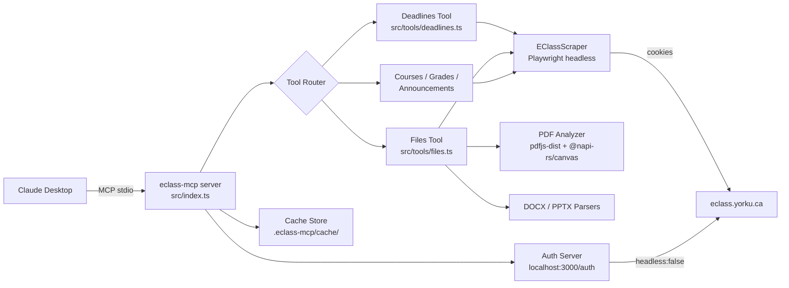

# 🎓 eClass MCP

> **Connect Claude to York University's eClass — assignments, deadlines, grades, and course files, right inside your AI assistant.**

[](https://nodejs.org/)
[](https://www.typescriptlang.org/)
[](https://modelcontextprotocol.io/)
[](https://playwright.dev/)

---

## 🤔 What this is / What this is not

| ✅ This IS | ❌ This is NOT |
|---|---|
| A local MCP server that lets Claude read your eClass data | A public API or cloud service |
| A scraping layer using your own authenticated session | A way to bypass any security or act on behalf of other users |
| A tool for students to get faster, AI-assisted access to their own coursework | A replacement for the eClass website |
| Entirely local — your session and data never leave your machine | Affiliated with or endorsed by York University |

---

## ✨ Features at a Glance

- 📅 **Smart Deadlines** — upcoming, month-by-month, and arbitrary date ranges
- 📄 **PDF Intelligence** — hybrid text + vision extraction (text pages stay cheap; image pages render at 100 DPI)
- 🔍 **Assignment Deep-Dive** — instructions, submission status, and grades for any assignment or quiz URL
- 🏆 **Grades** — per-course or overview grade reports
- 📣 **Announcements** — course news and forum posts
- 🗂️ **Course Content** — file/resource listings per course section
- 🔐 **Session Auth** — one-click login via a local browser window; sessions cached for ~60 hours
- 💾 **Smart Caching** — file-based JSON cache with per-resource TTLs (7 days for files, 1–24 hours for live data)

---

## 🏗️ Architecture



---

## 🛠️ MCP Tools — Quick Reference

| Tool | Purpose | Key Parameters |
|------|---------|---------------|
| `list_courses` | List enrolled courses | — |
| `get_course_content` | Sections, files, assignments for one course | `courseId` |
| `get_upcoming_deadlines` | Assignments due in the next N days | `daysAhead?`, `courseId?` |
| `get_deadlines` | Deadlines by scope: upcoming / month / range | `scope`, `month?`, `year?`, `from?`, `to?`, `includeDetails?`, `maxDetails?` |
| `get_item_details` | Full instructions + status + grade for one assignment or quiz URL | `url` |
| `get_file_text` | Extract text (and rendered images) from PDF, DOCX, or PPTX | `courseId`, `fileUrl`, `startPage?`, `endPage?` |
| `get_grades` | Grade report (all courses or one) | `courseId?` |
| `get_announcements` | Recent course announcements | `courseId?`, `limit?` |

> 📖 Deep-dive: [Deadlines & Details tool docs](docs/tools/deadlines/roadmap.md) · [PDF pipeline docs](docs/tools/get_file_text/history.md)

---

## 🚀 Quick Start

### Prerequisites

- Node.js ≥ 18
- [Claude Desktop](https://claude.ai/download) (macOS or Windows)
- A York University eClass account

### 1 — Clone & Install

```bash
git clone https://github.com/YOUR_USERNAME/eclass-mcp.git
cd eclass-mcp
npm install
```

### 2 — Install Playwright's Chromium Browser

```bash
npx playwright install chromium
```

> ⚠️ This is required for scraping. If you see `ENOSPC`, free up disk space and retry.

### 3 — Configure Environment

```bash
cp .env.example .env
# .env defaults are fine for most users — no changes needed
```

### 4 — Build & Register with Claude Desktop

```bash
npm run setup
```

This compiles TypeScript and writes the MCP entry into your Claude Desktop config file automatically.

### 5 — Restart Claude Desktop

Right-click the tray icon → **Quit**, then relaunch.

### 6 — Authenticate

The first time Claude tries to use an eClass tool, you'll see:

> *"eClass session not found. Please visit http://localhost:3000/auth"*

Open that URL. A visible browser window opens — log in with your York credentials (including MFA if required). Once you land on the eClass dashboard, the session is saved automatically and the browser closes.

You're done. Ask Claude anything about your courses.

---

## 💬 Typical Usage

```
"What assignments do I have due this week?"
"Show me my deadlines for March 2026, including past ones."
"Get the full instructions and my submission status for this assignment:
  https://eclass.yorku.ca/mod/assign/view.php?id=XXXXX"
"Read the lecture slides from EECS 1028 — Week 5."
"What are my current grades in all courses?"
"Any recent announcements from my professors?"
```

For large PDFs, Claude will automatically paginate:
```
"Read pages 10–20 of that lecture PDF."
```

---

## 🔧 Troubleshooting

### 🔑 Authentication / Session

| Symptom | Fix |
|---------|-----|
| `"eClass session expired"` | Visit `http://localhost:3000/auth` and log in again |
| Session expires too fast | Session TTL is 60 hours — this is intentional (York sessions expire ~72h) |
| Login window doesn't open | Navigate to `http://localhost:3000/auth` manually in your browser |
| Login page loops or redirects | Clear your browser cookies for `eclass.yorku.ca` and try again |

### 🎭 Playwright Browser

| Symptom | Fix |
|---------|-----|
| `browserType.launch: Executable doesn't exist` | Run `npx playwright install chromium` in the project root |
| `ENOSPC` during install | Free up disk space (Chromium needs ~300 MB) |
| Scraping hangs or times out | Check your network; eClass may be under load |

### 💾 Cache / Stale Data

| Symptom | Fix |
|---------|-----|
| Old course data showing up | Delete `.eclass-mcp/cache/` to force a full refresh |
| File content outdated | Delete the specific `file_<hash>_v2.json` from `.eclass-mcp/cache/` |
| Grades not updating | Cache TTL for grades is 12 hours — delete `grades_*.json` to force refresh |

### 🏗️ Build Errors

```bash
# Check for TypeScript errors
npx tsc --noEmit

# Rebuild from scratch
rm -rf dist && npm run build
```

---

## 📚 Docs Map

| Topic | Location |
|-------|----------|
| Deadlines tool — full roadmap & architecture | [`docs/tools/deadlines/roadmap.md`](docs/tools/deadlines/roadmap.md) |
| Deadlines — implementation history | [`docs/tools/deadlines/history.md`](docs/tools/deadlines/history.md) |
| Deadlines — known issues & investigation log | [`docs/tools/deadlines/failed-prompts-investigation-plan.md`](docs/tools/deadlines/failed-prompts-investigation-plan.md) |
| PDF pipeline — engineering deep-dive | [`docs/tools/get_file_text/history.md`](docs/tools/get_file_text/history.md) |
| PDF pipeline — future roadmap (smart image detection) | [`docs/tools/get_file_text/roadmap.md`](docs/tools/get_file_text/roadmap.md) |
| Master TODO | [`TODO.md`](TODO.md) |

---

## 🗺️ Roadmap Snapshot

> Full detail in the linked docs above.

- [x] Upcoming deadlines scraper (Moodle 4 / Moove theme)
- [x] Month + range deadline queries via assignment index pages
- [x] Assignment and quiz detail scraping (instructions, submission status, grades)
- [x] Smart PDF extraction — hybrid text + image rendering pipeline
- [x] DOCX and PPTX parsers
- [ ] **Harden quiz page selectors** — grade extraction missing in some cases *(P3)*
- [ ] **Richer assignment descriptions** — extract authored content, not just boilerplate *(P4)*
- [ ] **Grades tool** — full gradebook scraping with feedback
- [ ] **Announcements tool** — full post body extraction
- [ ] **Smart image detection** — entropy/vision-based diagram isolation for PDFs

---

## 🧑‍💻 Contributing / Dev Workflow

```bash
# Run in dev mode (auto-restarts on save)
npm run dev

# Type-check without compiling
npx tsc --noEmit

# Test deadline scraping against live eClass
npx ts-node scripts/test-deadlines.ts

# Test item detail fetching
npx ts-node scripts/test-item-details.ts

# Test PDF parser on a local file
npx ts-node scripts/test-pdf-parser.ts ./path/to/file.pdf

# Debug a specific file URL
npx ts-node scripts/debug-file-url.ts "https://eclass.yorku.ca/mod/resource/view.php?id=XXXXX"
```

All scraping tests require a valid session (`npm run setup` + authenticate via `/auth` first).

**One task at a time.** Each feature area has its own roadmap doc — read it before changing anything in that area. Update `docs/` and `TODO.md` after completing a task.

---

## 🔒 Privacy

Everything runs **entirely on your machine**:
- Your eClass session cookie is stored in `.eclass-mcp/session.json` (gitignored)
- Parsed file content is cached in `.eclass-mcp/cache/` (gitignored)
- No data is sent to any third-party service
- The MCP server communicates only with Claude Desktop over local stdio and with `eclass.yorku.ca` using your session

---

## 📄 License

ISC — see `LICENSE` file.

---

<p align="center"><sub>Built for York University students. Not affiliated with or endorsed by York University.</sub></p>