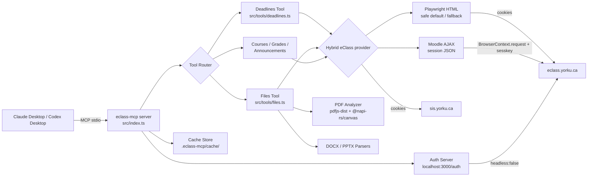

# 🎓 eClass MCP

> **Connect Claude Desktop or Codex Desktop to York University's eClass — assignments, deadlines, grades, and course files, right inside your AI assistant.**

> **Current engine stage:** `1.0.0-beta.3`
>
> The engine versioning and release policy now lives in [`docs/PROJECT_MASTER.md`](docs/PROJECT_MASTER.md#engine-versioning--release-policy). The historical core-only release is treated as `0.9.0-core`, and the engine line is versioned separately from the eventual product surfaces.

[](https://nodejs.org/)
[](https://www.typescriptlang.org/)
[](https://modelcontextprotocol.io/)
[](https://playwright.dev/)

---

## 🤔 What this is / What this is not

| ✅ This IS                                                                                                       | ❌ This is NOT                                               |
| ---------------------------------------------------------------------------------------------------------------- | ------------------------------------------------------------ |
| A local MCP server that lets Claude Desktop or Codex Desktop read your eClass data                               | A public API or cloud service                                |
| A scraping layer using your own authenticated session                                                            | A way to bypass any security or act on behalf of other users |
| A tool for students to get faster, AI-assisted access to their own coursework                                    | A replacement for the eClass website                         |
| Local-first — auth state/cache stay on your machine; tool requests go directly to the services you choose to use | Affiliated with or endorsed by York University               |

---

## ✨ Features at a Glance

- 📅 **Smart Deadlines** — upcoming, month-by-month, and arbitrary date ranges
- 📄 **PDF Intelligence** — hybrid text + vision extraction (text pages stay cheap; image pages render at 100 DPI)
- 🔍 **Assignment Deep-Dive** — instructions, submission status, and grades for any assignment or quiz URL
- 🏆 **Grades** — per-course or overview grade reports
- 📣 **Announcements** — course news and forum posts
- 🗂️ **Course Content** — file/resource listings per course section
- 🎓 **SIS Integration** — personal exam schedules and class timetables (lectures, labs, tutorials)
- 🔐 **Session Auth** — one-click login via a local browser window; session bridging for both eClass and SIS domains; eClass/SIS tools wait briefly and retry once after re-auth
- 💾 **Smart Caching** — tiered file-based JSON cache with versioned schemas (Hot 30m, Warm 20m, Course 3h, Stable 48h)
- 📝 **Cache Transparency** — cache-backed JSON tools return an `_cache` object representing data freshness (hit/miss, fetched_at, expires_at)
- 🧹 **Granular Invalidation** — manual `clear_cache` clears **default** TTL cache only; **user-pinned** entries stay until you `cache_delete_pinned` or `cache_unpin`; automatic volatile clearing on re-auth
- 📌 **Pinned cache (T27)** — pin files, section text, or course content to keep past TTL; on-disk quota via `ECLASS_MCP_PIN_QUOTA_BYTES` (default 300 MiB)

- **Cross-platform assignments** - `get_assignments` is the default resolver for assignment/homework/deadline questions. It checks eClass first, then uses the permanent course-platform index and Cengage/WebAssign dashboard inventory when eClass is empty, a mapping exists, or external lookup is requested. WebAssign rows are only returned after the active course context is verified.

### Tool output contracts (E11)

Tool responses are validated with **Zod** before serialization (`src/tools/eclass-contracts.ts`, `src/tools/mcp-validated-response.ts`). By default validation is **non-fatal**: `safeParse` runs, unknown/extra keys are allowed via `.passthrough()`, and on mismatch the server logs a warning and still returns the payload JSON. Set **`ECLASS_MCP_STRICT_TOOL_OUTPUT=1`** in `.env` only when you want validation to throw (local debugging). Cengage tools keep their own schema boundary in `src/tools/cengage/responses.ts`.

### Structured error codes (E12, phased)

Machine-readable **`code`** values (e.g. `SESSION_EXPIRED`, `SCRAPE_LAYOUT_CHANGED`, `VALIDATION_FAILED`) are defined in `src/errors/codes.ts`. Helpers in `src/errors/tool-error.ts` build consistent JSON alongside existing `message` / `status` fields. Schemas in `eclass-contracts.ts` allow **optional** `code` so older payloads still validate; tools gain `code` incrementally by phase. Scraper layout drift uses `ScrapeLayoutError` in `src/scraper/scrape-errors.ts` (returned as JSON from `get_file_text` when a file download wrapper cannot be resolved).

### Auth retry behavior (T36)

When an eClass or SIS-backed tool hits `SESSION_EXPIRED`, the server opens `/auth`, waits up to **2 minutes** for the saved session to become valid, and retries the original tool operation once. If login is not completed in time, the tool returns the existing structured `status="auth_required"` response with retry guidance. Override the wait with **`ECLASS_MCP_AUTH_WAIT_MS`** in `.env`.

### Secure session storage (E13)

Local eClass/SIS cookies and Cengage/WebAssign Playwright storage state are encrypted at rest under `.eclass-mcp/` with `ECLASS_MCP_SESSION_SECRET`. The default install will not save or load auth sessions until that secret is set. Changing the secret invalidates saved sessions and requires re-authentication. Legacy plaintext session files from earlier versions are rejected; use `http://localhost:<AUTH_PORT>/logout` or delete the old auth files, then log in again.

### Logging (E14)

Structured **JSON logs** go to **stderr** (stdout stays clean for MCP stdio). Each tool call gets a **`requestId`**, **`traceId`**, **`spanId`**, and **`tool`** name via `runWithToolContext` in `src/index.ts`; high-value nested operations use `runWithSpan`. Set **`ECLASS_MCP_LOG_LEVEL`** (`trace` … `silent`, default `info`) to control verbosity. Details: [`docs/logging.md`](docs/logging.md).

### Selector drift diagnostics (E15)

Scraper selectors are grouped in a typed registry under `src/scraper/selectors/`. Migrated eClass and Cengage/WebAssign paths log `selector_match` at debug level with the page type, selector group, winning candidate, match count, and URL. If a required selector group no longer matches the page, tools return structured `SCRAPE_LAYOUT_CHANGED` errors instead of hiding DOM drift as an internal failure.

Optional debug snapshots are disabled by default. Set `ECLASS_MCP_SELECTOR_DEBUG_SNAPSHOTS=1` only during local debugging to write bounded HTML and JSON metadata under `.eclass-mcp/debug/selectors/`.

### Operational limits (E19)

Navigation timeouts, auth wait windows, current concurrency posture, and rate-limit behavior are documented in [`docs/operational-limits.md`](docs/operational-limits.md). Slow external pages should map to structured `TIMEOUT`, `RATE_LIMITED`, or `UPSTREAM_ERROR` responses when the tool can classify them; platform-specific auth and activation states may produce more specific guidance.

### Future write safety (E20)

Future write tools are designed around accuracy-first preflight, not hidden registration gates. A risky assignment write must first call the read-only `prepare_assignment_submission` tool, which returns the exact platform, course, assignment, due date, submission state, upload constraints, intended-file facts, warnings, and a signed `preflightRef`. The real write call must include that `preflightRef` plus `confirm: true`; the server rechecks the page before mutating and fails if the target is ambiguous, stale, or changed. Claude tool permissions are useful UX controls, but server-side target verification is the safety source of truth.

---

## 🏗️ Architecture


```mermaid
flowchart LR
    A[Claude Desktop / Codex Desktop] -- MCP stdio --> B[eclass-mcp server\nsrc/index.ts]
    B --> C{Tool Router}
    C --> D[Deadlines Tool\nsrc/tools/deadlines.ts]
    C --> E[Files Tool\nsrc/tools/files.ts]
    C --> F[Courses / Grades /\nAnnouncements]
    D --> G{Hybrid eClass provider}
    E --> G
    F --> G
    G --> H1[Playwright HTML\nsafe default / fallback]
    G --> H2[Moodle AJAX\nsession JSON]
    H1 -- cookies --> H[eclass.yorku.ca]
    H2 -- BrowserContext.request + sesskey --> H
    G -- cookies --> S[sis.yorku.ca]
    E --> I[PDF Analyzer\npdfjs-dist + @napi-rs/canvas]
    E --> J[DOCX / PPTX Parsers]
    B --> K[Cache Store\n.eclass-mcp/cache/]
    B --> L[Auth Server\nlocalhost:3000/auth]
    L -- headless:false --> H
```

### Hybrid eClass data access

The eClass provider keeps the visible browser for Passport York / Shibboleth
authentication and HTML-only reads, while proven read-only Moodle AJAX calls
use the authenticated `BrowserContext.request` transport:

- `list_courses` uses the enrolled-course AJAX function.
- Course outlines use Moodle course-format state.
- Deadline reads use the proven calendar functions.
- `shadow` runs both paths but returns Playwright data and records only
  shape-level mismatch categories.
- `api` uses one bounded Playwright fallback for eligible read failures.
- Grades, forums, assignment details, submission preflight, and plugin-file
  reads remain Playwright-backed. The mobile launch and capability-gated REST
  client are not exposed as REST-backed MCP tools until each function has
  account-owner live proof.

The safe default is Playwright mode. Configure the optional rollout locally:

```powershell
# Safe default; also the rollback setting.
ECLASS_API_SOURCE_MODE=playwright

# Optional shadow comparison or API-primary canary.
ECLASS_API_TIMEOUT_MS=15000
```

Authenticated debug page dumps stay disabled unless
`ECLASS_MCP_ALLOW_AUTH_DEBUG_DUMPS=1` is explicitly set for local diagnosis.

API-primary can be disabled without rebuilding by setting
`ECLASS_API_SOURCE_MODE=playwright` and restarting the MCP host. Do not put
tokens, `sesskey` values, cookies, or launch redirect locations in `.env`,
cache files, logs, or tool output. Mobile credentials, when minted by a
future account-owner flow, remain in the encrypted session envelope only.

---

## 🛠️ MCP Tools — Quick Reference

| Tool                             | Purpose                                                                                                                                                                                          | Key Parameters                                                                                                                                                                                                                                               |
| -------------------------------- | ------------------------------------------------------------------------------------------------------------------------------------------------------------------------------------------------ | ------------------------------------------------------------------------------------------------------------------------------------------------------------------------------------------------------------------------------------------------------------ |
| `list_courses`                   | List enrolled courses                                                                                                                                                                            | —                                                                                                                                                                                                                                                            |
| `get_course_content`             | Sections, files, assignments for one course                                                                                                                                                      | `courseId`                                                                                                                                                                                                                                                   |
| `get_section_text`               | Section page text, links, and tabbed content                                                                                                                                                     | `url`                                                                                                                                                                                                                                                        |
| `get_assignments`                | Canonical cross-platform resolver for eClass + Cengage/WebAssign assignments                                                                                                                     | `courseId?`, `courseCode?`, `courseQuery?`, `scope?`, `month?`, `year?`, `from?`, `to?`, `includeExternal?`, `platformSelection?`                                                                                                                            |
| `prepare_assignment_submission`  | Read-only T37 preflight for future assignment writes; resolves eClass/Moodle upload state or Cengage/WebAssign assignment facts and signs an exact `preflightRef`                                | `platform?`, `assignmentUrl?`, `courseId?`, `courseCode?`, `courseQuery?`, `assignmentId?`, `assignmentQuery?`, `entryUrl?`, `ssoUrl?`, `courseKey?`, `intendedFiles?`                                                                                        |
| `get_upcoming_deadlines`         | eClass-only assignments due in the next N days; use `get_assignments` for external-platform coverage                                                                                             | `daysAhead?`, `courseId?`                                                                                                                                                                                                                                    |
| `get_deadlines`                  | eClass-only deadlines by scope: upcoming / month / range                                                                                                                                         | `scope`, `month?`, `year?`, `from?`, `to?`, `includeDetails?`, `maxDetails?`                                                                                                                                                                                 |
| `get_item_details`               | Full instructions + status + grade for one assignment or quiz URL                                                                                                                                | `url`, `includeImages?`, `maxImages?`, `imageOffset?`, `maxTotalImageBytes?`, `includeCsv?`, `csvMode?`, `maxCsvBytes?`, `csvPreviewLines?`, `maxCsvAttachments?`                                                                                            |
| `get_file_text`                  | Extract text (and rendered images) from PDF, DOCX, or PPTX                                                                                                                                       | `courseId`, `fileUrl`, `startPage?`, `endPage?`                                                                                                                                                                                                              |
| `get_grades`                     | Grade report (all courses or one)                                                                                                                                                                | `courseId?`                                                                                                                                                                                                                                                  |
| `get_announcements`              | Recent course announcements                                                                                                                                                                      | `courseId?`, `limit?`                                                                                                                                                                                                                                        |
| `get_exam_schedule`              | List your upcoming personal exam schedule from York SIS                                                                                                                                          | —                                                                                                                                                                                                                                                            |
| `get_class_timetable`            | List your personal class timetable (lectures/labs) from York SIS                                                                                                                                 | —                                                                                                                                                                                                                                                            |
| `search_professors`              | Finds professor profiles on RateMyProfessors                                                                                                                                                     | `name`, `campus?`                                                                                                                                                                                                                                            |
| `get_professor_details`          | Fetches detailed ratings, difficulty, and comments for a professor                                                                                                                               | `teacherId`                                                                                                                                                                                                                                                  |
| `discover_cengage_links`         | Detect and classify Cengage/WebAssign links from pasted text or extracted content                                                                                                                | `text`, `source?`, `courseId?`, `sectionUrl?`, `sourceFile?`                                                                                                                                                                                                 |
| `list_cengage_courses`           | List visible Cengage dashboard course materials, including WebAssign and OWLv2/CengageNOW cards                                                                                                  | `entryUrl?`, `discoveredLink?`, `courseQuery?`                                                                                                                                                                                                               |
| `get_cengage_assignments`        | Fetch WebAssign-backed Cengage assignments from direct course/LTI links or saved-session dashboard flow with active-course verification; OWLv2/CengageNOW courses are listed but not scraped yet | `courseId?`, `courseKey?`, `courseQuery?`, `allCourses?`, `maxCourses?`, `maxAssignmentsPerCourse?`, `entryUrl?`, `ssoUrl?` (legacy)                                                                                                                         |
| `get_cengage_assignment_details` | Fetch question-level Cengage/WebAssign assignment details with prompt sections, asset inventory, rendered-media fallback metadata, and scoring hints                                             | `assignmentUrl?`, `assignmentId?`, `assignmentQuery?`, `courseId?`, `courseKey?`, `courseQuery?`, `includeAnswers?`, `includeResources?`, `includeAssetInventory?`, `includeRenderedMedia?`, `maxQuestions?`, `maxQuestionTextChars?`, `maxAnswerTextChars?` |
| `clear_cache`                    | Clears **non-pinned** cache by scope (`all`, `volatile`, `deadlines`, …); pins are **not** removed                                                                                               | `scope?`                                                                                                                                                                                                                                                     |
| `cache_health`                   | Read-only aggregate cache and pin health, local warning summaries, and process-local cache metrics                                                                                               | none                                                                                                                                                                                                                                                         |
| `cache_pin`                      | Pin a resource already in cache (kept past TTL until unpinned)                                                                                                                                   | `resource_type`, `fileUrl?` / `url?` / `courseId?`, `note?`                                                                                                                                                                                                  |
| `cache_unpin`                    | Remove pin metadata without deleting cache files                                                                                                                                                 | `pinId`                                                                                                                                                                                                                                                      |
| `cache_list_pins`                | List pins and quota usage                                                                                                                                                                        | `resource_type?`                                                                                                                                                                                                                                             |
| `cache_refresh_pin`              | Re-fetch and refresh cached data for a pin                                                                                                                                                       | `pinId`                                                                                                                                                                                                                                                      |
| `cache_delete_pinned`            | Delete pinned cache files and registry entries (explicit)                                                                                                                                        | `pinId` or `mode` + `resource_type?`                                                                                                                                                                                                                         |

### User-pinned cache semantics

1. **Fetch first** — call `get_file_text`, `get_section_text`, or `get_course_content` so the entry exists under `.eclass-mcp/cache/`, then call `cache_pin` with the same identifiers.
2. **`clear_cache`** — removes only **default** TTL cache entries; **pinned** files are skipped. The tool response states that pins were unchanged.
3. **Removing pins** — `cache_unpin` drops the pin only; **`cache_delete_pinned`** deletes the on-disk cache file(s) and registry rows (use `pinId`, or `mode=all`, or `mode=by_type` + `resource_type`).
4. **Stale data** — pinned entries past TTL may still be served; JSON tools add `_cache.stale: true`; `get_file_text` prepends a short notice. Use `cache_refresh_pin` to refetch.
5. **Quota** — set `ECLASS_MCP_PIN_QUOTA_BYTES` in `.env` (bytes). Pinning fails with a structured `quota_exceeded` payload if the new pin would exceed the limit.

### Cengage and WebAssign workflow (dashboard-first default)

0. **Default assignment questions:** use `get_assignments` first. It decides whether eClass alone is enough, whether Cengage/WebAssign must be checked, and whether the user needs Cengage auth or course selection.
1. **Default workflow:** authenticate once via `/auth-cengage`, call `list_cengage_courses` without `entryUrl`, then call `get_cengage_assignments` with `courseQuery`, `courseId`, or `courseKey`.
2. **Aggregation workflow:** set `allCourses=true` in `get_cengage_assignments` to collect bounded summaries across dashboard courses (`maxCourses`, `maxAssignmentsPerCourse`).
3. **Platform coverage:** `list_cengage_courses` reports visible dashboard materials even when they are OWLv2/CengageNOW instead of WebAssign. Assignment extraction is currently WebAssign-only, so OWLv2 courses return a clear unsupported-platform message instead of disappearing from the course list.
4. **Details workflow:** after selecting an assignment, call `get_cengage_assignment_details` with `assignmentId`/`assignmentUrl`/`assignmentQuery` for question-level extraction and structured metadata.
5. **When enrollment links still matter:** use explicit `entryUrl` when the course is not yet visible in dashboard inventory (for example first-time enrollment wrappers) or when reproducing a specific launch path. Direct WebAssign/LTI links are tried before dashboard selection.
6. **Discovery role:** `discover_cengage_links` is bootstrap/fallback only; use it after dashboard-first calls cannot locate the needed course, then retry with discovered `entryUrl`/selection input.
7. **Compatibility path:** `get_cengage_assignments` and `get_cengage_assignment_details` still accept legacy `ssoUrl`; `entryUrl` remains the preferred explicit-link field.
8. **Selection behavior:** when multiple courses match, responses may return `status="needs_course_selection"`; provide `courseId`, `courseKey`, or `courseQuery` and retry.
9. **Auth behavior parity:** when Cengage session state is missing or stale, responses return `status="auth_required"` with retry guidance and a dynamic `authUrl`.
10. **Activation guard:** WebAssign may open a previous active course even when the launch URL contains the requested `courseKey`. The tools verify the active WebAssign course context before returning rows.
11. **Response contract:** Cengage tools follow structured status values (`ok`, `auth_required`, `needs_course_selection`, `needs_course_activation`, `no_data`, `error`) and include `_cache` freshness metadata.

### Course platform index

`get_assignments` writes durable eClass-to-Cengage/WebAssign course mappings to `.eclass-mcp/course-platform-index.json`. This file is user state, not TTL cache: `clear_cache` does not delete it, and Cengage re-auth only clears volatile dashboard caches. If a course match is ambiguous, retry `get_assignments` with `platformSelection.cengage.courseId`, `courseKey`, or `courseQuery`; the selected mapping is then remembered for the term. If activation fails because WebAssign opens a different active course, the mapping stays linked and the index records activation diagnostics instead of deleting the correct course identity.

> 📖 **Master plan (roadmaps, history, engine beta, engineering):** [docs/PROJECT_MASTER.md](docs/PROJECT_MASTER.md) · Deep-dive: [Deadlines](docs/tools/deadlines/roadmap.md) · [PDF pipeline](docs/tools/get_file_text/history.md)

---

### 🧪 Testing & Validation

For server-level validation (verifying raw JSON before putting it into a host like Claude):

1. Stop any running server instances.
2. Launch the [MCP Inspector](https://github.com/modelcontextprotocol/inspector):

   ```powershell
   npx.cmd @modelcontextprotocol/inspector node dist/index.js
   ```

3. Open `http://localhost:6274` in your browser.
4. Test individual tools and inspect JSON payloads.

If you are in PowerShell and `npm` / `npx` fail with an execution-policy error, use the `.cmd`
variants explicitly (`npm.cmd`, `npx.cmd`) or run the command through `cmd /c`.

_For formal E2E test runs, see the **[E2E Handbook](docs/t11-e2e-handbook.md)** and the **[E2E Run Log](docs/e2e-run-log.md)**._

---

## 🚀 Quick Start

### Prerequisites

- Node.js ≥ 20.19.0
- [Claude Desktop](https://claude.ai/download) (macOS or Windows) or Codex Desktop on Windows
- A York University eClass account

### 1 — Clone & Install

```powershell
git clone <your-repo-url>
cd eclass-mcp
npm install
```

### 2 — Install Playwright's Chromium Browser

```powershell
npx.cmd playwright install chromium
```

> ⚠️ This is required for scraping. If you see `ENOSPC`, free up disk space and retry.

### 3 — Configure Environment

```powershell
copy .env.example .env
# Edit .env and set ECLASS_MCP_SESSION_SECRET to a long local secret before authenticating.
```

Run the read-only setup health check before debugging or registering an MCP host:

```powershell
npm run doctor
```

Doctor checks Node/npm, the build artifact, Playwright Chromium, `.env`, secure session configuration, Claude Desktop config, Codex Desktop config on Windows, permissions, and auth/session hints without opening a browser or changing local files.

### 4 — Build & Register with a Desktop Host

#### Codex Desktop on Windows

Codex Desktop uses the global Codex config at `%USERPROFILE%\.codex\config.toml`.
Preview the change first, then register the local stdio MCP server:

```powershell
npm run setup:codex -- --dry-run
npm run setup:codex
```

The dry run prints the proposed Codex `mcp_servers.eclass` block without writing files. The real setup compiles TypeScript, creates a timestamped backup when an existing Codex config is present, and atomically writes the `eclass` MCP entry.

To inspect or restore setup backups later:

```powershell
npm run setup:codex -- --list-backups
npm run setup:codex -- --restore latest
```

Restart Codex Desktop after setup. In Codex, open the MCP/tools UI or ask a course question. If auth is missing, open `http://localhost:3000/auth`, complete York login, then retry.

#### Claude Desktop

```bash
npm run setup -- --dry-run
npm run setup
```

The dry run prints the proposed Claude Desktop config change without writing files. The real setup compiles TypeScript, creates a timestamped backup when an existing Claude config is present, and atomically writes the `eclass` MCP entry.

To inspect or restore setup backups later:

```bash
npm run setup -- --list-backups
npm run setup -- --restore latest
```

### 5 — Restart Your Desktop Host

For Claude Desktop, right-click the tray icon → **Quit**, then relaunch. For Codex Desktop, fully quit and relaunch the app so it reloads `%USERPROFILE%\.codex\config.toml`.

### 6 — Authenticate

The first time Claude or Codex tries to use an eClass tool, you'll see:

> _"eClass session not found. Please visit <http://localhost:3000/auth>"_

Open that URL. A visible browser window opens — log in with your York credentials (including MFA if required). Once you land on the eClass dashboard, the session is saved automatically and the browser closes.

Cengage/WebAssign auth uses the same encrypted local session store. If a Cengage tool returns `auth_required`, open the returned `/auth-cengage` URL after `ECLASS_MCP_SESSION_SECRET` is configured.

You're done. Ask Claude or Codex anything about your courses.

---

## 💬 Typical Usage

```
"What assignments do I have due this week?"
"Check all assignments for MATH 1014 across eClass and Cengage/WebAssign."
"Show me my deadlines for March 2026, including past ones."
"Get the full instructions and my submission status for this assignment:
  https://eclass.yorku.ca/mod/assign/view.php?id=XXXXX"
"Read the lecture slides from EECS 1028 — Week 5."
"What are my current grades in all courses?"
"Any recent announcements from my professors?"
"What are my upcoming exams?"
"What is my class schedule this week?"
"Find professor John Doe on RateMyProfessors."
"What do students say about the difficulty of John Doe's classes?"
"List my Cengage/WebAssign courses from my saved session."
"Get Cengage assignments for MATH 1014 using courseQuery."
"Get full question-level details for Cengage assignment 38902818 in courseKey WA-production-1606311."
"Get Cengage assignment summaries across all my courses (bounded mode)."
"If dashboard-first misses the course, find Cengage/WebAssign links in this syllabus text as fallback."
```

For large PDFs, Claude will automatically paginate:

```
"Read pages 10–20 of that lecture PDF."
```

For instruction screenshots embedded in assignments, you can enable vision:

```
"Read the full instructions from this assignment, including any screenshots."
Use `eclass:get_item_details` with includeImages=true if your client supports it.
```

For small CSV attachments, you can inline them as text:

```
"Read the CSV attachment data from this assignment."
Use `eclass:get_item_details` with includeCsv=true (csvMode=full or preview).
```

---

## 🔧 Troubleshooting

### 🔑 Authentication / Session

| Symptom                       | Fix                                                                                                                                                                                                                                |
| ----------------------------- | ---------------------------------------------------------------------------------------------------------------------------------------------------------------------------------------------------------------------------------- |
| Unsure what is misconfigured  | Run `npm run doctor` in the project root for a read-only checklist and exact next actions                                                                                                                                          |
| Want to preview setup changes | Run `npm run setup -- --dry-run`; it prints the Claude config diff and does not write files                                                                                                                                        |
| Claude config needs rollback  | Run `npm run setup -- --list-backups`, then `npm run setup -- --restore latest` or restore a specific listed backup path                                                                                                           |
| Codex tools not visible       | Restart Codex Desktop, run `npm run doctor`, and inspect `%USERPROFILE%\.codex\config.toml`; rerun `npm run setup:codex` if the target is stale                                                                                    |
| Codex login/tool timeout      | Confirm `tool_timeout_sec = 180` under `[mcp_servers.eclass]` in `%USERPROFILE%\.codex\config.toml`; rerun `npm run setup:codex` if needed                                                                                         |
| `"eClass session expired"`    | Visit `http://localhost:3000/auth` and log in again                                                                                                                                                                                |
| `SESSION_STORAGE_UNAVAILABLE` | Set `ECLASS_MCP_SESSION_SECRET` in `.env`, restart the MCP server, clear old plaintext auth sessions, then authenticate again                                                                                                      |
| `SCRAPE_LAYOUT_CHANGED`       | The eClass/Cengage page layout no longer matches known selectors. Retry once after refreshing auth if the page was mid-login; otherwise inspect stderr `selector_match` / `selector_failure` logs and optional selector snapshots. |
| Wrong/changed session secret  | Restore the previous `ECLASS_MCP_SESSION_SECRET` or clear sessions at `http://localhost:3000/logout` and log in again                                                                                                              |
| Legacy plaintext session file | Clear local auth sessions at `http://localhost:3000/logout` or delete `.eclass-mcp/session.json` / `.eclass-mcp/cengage-state.json`, then re-authenticate                                                                          |
| Session expires too fast      | Session TTL is 60 hours — this is intentional (York sessions expire ~72h)                                                                                                                                                          |
| Login window doesn't open     | Navigate to `http://localhost:3000/auth` manually in your browser                                                                                                                                                                  |
| Login page loops or redirects | Clear your browser cookies for `eclass.yorku.ca` and try again                                                                                                                                                                     |

### 🎭 Playwright Browser

| Symptom                                        | Fix                                                       |
| ---------------------------------------------- | --------------------------------------------------------- |
| `browserType.launch: Executable doesn't exist` | Run `npx playwright install chromium` in the project root |
| `ENOSPC` during install                        | Free up disk space (Chromium needs ~300 MB)               |
| Scraping hangs or times out                    | Check your network; eClass may be under load              |

### 💾 Cache / Stale Data

| Symptom                       | Fix                                                                                                                                                                      |
| ----------------------------- | ------------------------------------------------------------------------------------------------------------------------------------------------------------------------ |
| Old course data showing up    | Delete `.eclass-mcp/cache/` to force a full refresh                                                                                                                      |
| File content outdated         | Use `clear_cache`/pin refresh tools, or delete the relevant versioned `v1_file_*.json` file from `.eclass-mcp/cache/`                                                    |
| Course platform mapping wrong | Retry `get_assignments` with `platformSelection.cengage.courseId`, `courseKey`, or `courseQuery`; `clear_cache` does not delete `.eclass-mcp/course-platform-index.json` |
| Grades not updating           | Cache TTL for grades is 3 hours — use `clear_cache(scope="grades")` or delete the relevant versioned `v1_grades_*.json` file                                             |

### 🔗 Cengage / WebAssign Dashboard-First and Fallback Issues

| Symptom                                                  | Fix                                                                                                                                                                                                                                 |
| -------------------------------------------------------- | ----------------------------------------------------------------------------------------------------------------------------------------------------------------------------------------------------------------------------------- |
| `status="auth_required"` from Cengage tools              | Open the returned `retry.authUrl` (typically `http://localhost:<AUTH_PORT>/auth-cengage`), complete login, retry the same tool call                                                                                                 |
| `status="needs_course_selection"`                        | Retry with `courseId`, `courseKey`, or `courseQuery`; if unsure, call `list_cengage_courses` first to choose a deterministic candidate                                                                                              |
| Cengage/WebAssign reports a different course context     | Treat `needs_course_activation` as an activation problem, not "no assignments" or automatic auth expiry. Open the intended course from Cengage/WebAssign, then retry; the tool refuses to return rows from the wrong active course. |
| Dashboard-first call returns `status="no_data"`          | Re-run `/auth-cengage`, retry `list_cengage_courses` with no `entryUrl`, then use explicit `entryUrl` only if the course still does not appear                                                                                      |
| `discover_cengage_links` returns `no_data`               | Use this only as fallback and provide raw text that still contains full URLs (file/announcement extraction, not paraphrases)                                                                                                        |
| Explicit-link assignment call returns `status="no_data"` | Verify link resolves to an active course/dashboard for your account; then retry with `courseId`/`courseQuery` to force selection                                                                                                    |

### 🏗️ Build Errors

```bash
# Check for TypeScript errors
npx.cmd tsc --noEmit

# Rebuild from scratch
rm -rf dist && npm.cmd run build
```

---

## 📚 Docs Map

| Topic                                                                   | Location                                                                                                                                 |
| ----------------------------------------------------------------------- | ---------------------------------------------------------------------------------------------------------------------------------------- |
| Tool-by-tool docs index (all 26 tools)                                  | [`docs/tools/README.md`](docs/tools/README.md)                                                                                           |
| Cross-platform assignment resolver                                      | [`docs/tools/get_assignments/README.md`](docs/tools/get_assignments/README.md)                                                           |
| Cengage implementation and migration plan                               | [`docs/cengage-integration-implementation-plan.md`](docs/cengage-integration-implementation-plan.md)                                     |
| Deadlines tool — full roadmap & architecture                            | [`docs/tools/deadlines/roadmap.md`](docs/tools/deadlines/roadmap.md)                                                                     |
| Deadlines — implementation history                                      | [`docs/tools/deadlines/history.md`](docs/tools/deadlines/history.md)                                                                     |
| Deadlines — known issues & investigation log (archived)                 | [`docs/archive/tools/deadlines/failed-prompts-investigation-plan.md`](docs/archive/tools/deadlines/failed-prompts-investigation-plan.md) |
| Deadlines — vision instruction screenshots (no OCR)                     | [`docs/tools/deadlines/vision-image-reading.md`](docs/tools/deadlines/vision-image-reading.md)                                           |
| PDF pipeline — engineering deep-dive                                    | [`docs/tools/get_file_text/history.md`](docs/tools/get_file_text/history.md)                                                             |
| PDF pipeline — future roadmap (smart image detection)                   | [`docs/tools/get_file_text/roadmap.md`](docs/tools/get_file_text/roadmap.md)                                                             |
| **Project master** (plans, merged history, engine beta, 9+ engineering) | [`docs/PROJECT_MASTER.md`](docs/PROJECT_MASTER.md)                                                                                       |

---

## 🗺️ Roadmap Snapshot

> Full detail in the linked docs above.

- [x] Upcoming deadlines scraper (Moodle 4 / Moove theme)
- [x] Month + range deadline queries via assignment index pages
- [x] Assignment and quiz detail scraping (instructions, submission status, grades)
- [x] Vision instruction screenshots for assignments/quizzes (no OCR) with payload caps + pagination
- [x] CSV attachment inlining (full/preview) with byte/line limits
- [x] Smart PDF extraction — hybrid text + image rendering pipeline
- [x] DOCX and PPTX parsers
- [x] **Grades tool** — full gradebook scraping with feedback (`get_grades`)
- [x] **Announcements tool** — recent post extraction (`get_announcements`)
- [x] **Cengage/WebAssign tools** — discovery, course listing, assignment retrieval, and assignment-details extraction with auth-retry + `_cache` parity
- [ ] **Harden quiz page selectors** — grade extraction missing in some cases _(P3)_
- [ ] **Richer assignment descriptions** — extract authored content, not just boilerplate _(P4)_
- [ ] **Smart image detection** — entropy/vision-based diagram isolation for PDFs

---

## 🧑‍💻 Contributing / Dev Workflow

```bash
# Run in dev mode (auto-restarts on save)
npm run dev

# Type-check without compiling
npx tsc --noEmit

# Test deadline scraping against live eClass
npx ts-node scripts/test-deadlines.ts

# Test item detail fetching
npx ts-node scripts/test-item-details.ts

# Test PDF parser on a local file
npx ts-node scripts/test-pdf-parser.ts ./path/to/file.pdf

# Debug a specific file URL
npx ts-node scripts/debug-file-url.ts "https://eclass.yorku.ca/mod/resource/view.php?id=XXXXX"

# Test SIS (Exam/Timetable) scraping (archived probe)
npx ts-node scripts/archive/test-sis-scraper.ts
```

All scraping tests require a valid session (`npm run setup` + authenticate via `/auth` first).

**One task at a time.** Each feature area has its own roadmap under `docs/tools/` — read it before changing that area. Update `docs/` (and [`docs/PROJECT_MASTER.md`](docs/PROJECT_MASTER.md) for cross-cutting status) when you complete meaningful work.

---

## 🔒 Privacy

The MCP server itself runs **entirely on your machine**, and local state stays local:

- Your eClass/SIS cookies are encrypted in `.eclass-mcp/session.json` (gitignored) using `ECLASS_MCP_SESSION_SECRET`
- Your Cengage/WebAssign browser storage state is encrypted in `.eclass-mcp/cengage-state.json` (gitignored)
- Parsed file content, cache entries, pins, debug dumps, and course-platform mappings remain plaintext local files under `.eclass-mcp/`
- Selector debug snapshots are plaintext local debug artifacts and are only written when `ECLASS_MCP_SELECTOR_DEBUG_SNAPSHOTS=1`
- `http://localhost:<AUTH_PORT>/logout` removes local auth session files only; cache, pins, debug output, and course-platform mappings are left alone
- When you use remote-backed tools, requests are sent directly from your machine to the relevant service: York eClass/SIS, Cengage/WebAssign, or RateMyProfessors.
- URLs supplied by users or discovered from authenticated pages are restricted to HTTPS allowlisted upstream hosts and expected eClass/Cengage/WebAssign paths before authenticated fetch or navigation. Localhost/private-network URLs, unsafe protocols, embedded credentials, and host-spoofing suffixes are rejected.
- Pinned cache refresh re-validates stored file and section URLs before re-fetching, including pins created by older versions.
- No project-owned cloud service receives your data; Claude Desktop and Codex Desktop communicate with this MCP server over local stdio. Codex configuration only points to the local process; auth state, cache, pins, and mappings remain under the project `.eclass-mcp/` directory.

---

## 📄 License

Limited Personal Use License — see `LICENSE` file.

---

<p align="center"><sub>Built for York University students. Not affiliated with or endorsed by York University.</sub></p>
