# eClass API + Playwright Hybrid Implementation Plan

## 1. Confirmed decisions and non-negotiable rules

This plan incorporates the decisions confirmed before planning:

- **Scope:** cover the complete eClass strategy: session-based Moodle AJAX access, Playwright fallback, and the later optional Moodle mobile REST/token path. SIS and Cengage/WebAssign remain unchanged.
- **Branch:** use a new branch named `feat/eclass-hybrid-api`.
- **Isolation:** create that branch in a separate Git worktree from the current `HEAD`. Leave the current `master` checkout, including its modified and untracked files, exactly untouched. Do not stash, stage, commit, reset, or clean the current checkout.
- **Plan file:** add the final plan to `docs/plans/eclass-api-playwright-implementation.md` in the implementation branch.
- **Phase 1 transport:** use Playwright’s authenticated `BrowserContext.request` for Moodle API requests. Use an in-memory `sesskey` obtained by a minimal authenticated browser bootstrap. Keep the transport behind an interface so a native `fetch` transport can be added later without changing tools.
- **Mobile credential storage:** when the later REST path is implemented, store only the parsed mobile token in a versioned optional field inside the existing encrypted session file. Never put it in `.env`, cache files, logs, debug artifacts, or tool output.
- **Rollout:** keep Playwright as the default, add opt-in API shadow mode, and promote API-primary only after automated and local live comparisons pass.
- **Live validation:** local, account-owner-only York eClass validation is a required acceptance gate. No credentials, cookies, `sesskey`, mobile tokens, or `Location` headers may enter CI, commits, chat, screenshots, or shared logs.
- **Security scope:** include required hardening for loopback-only auth binding, CSRF protection for local auth actions, account-scoped authenticated caches, and complete API/token/log/debug redaction.
- **Commit discipline:** every meaningful step gets its own commit. If two steps are genuinely tiny and inseparable, they may share one commit; otherwise do not combine them. Tests and documentation for a change belong in the same commit as that change or in the immediately following dedicated test/docs commit. Do not amend commits, skip hooks, or push unless explicitly requested.

The current repository is on `master` at the time of planning and has uncommitted/untracked work, including the investigation and ADR files. The first execution task must re-check that state before creating the worktree.

## 2. Current evidence and architectural target

The durable decision is documented as proposed in [ADR 0010](C:/Users/sorou/OneDrive/Desktop/CoYork/eclass-mcp/docs/adr/0010-hybrid-eclass-data-access.md#L1-L54); no production code has switched away from Playwright. The investigation confirms that eClass’s AJAX gateway successfully provides enrolled courses, course-format state, and calendar data, while named grade, forum, assignment, and full-course-content functions were rejected by the AJAX gateway. See [the API feasibility investigation](C:/Users/sorou/OneDrive/Desktop/CoYork/eclass-mcp/docs/investigations/eclass-official-api-feasibility.md#L316-L415).

The current eClass session file stores only encrypted cookies and timestamps in [src/scraper/session.ts](C:/Users/sorou/OneDrive/Desktop/CoYork/eclass-mcp/src/scraper/session.ts#L48-L85), and authentication saves only browser cookies in [src/auth/server.ts](C:/Users/sorou/OneDrive/Desktop/CoYork/eclass-mcp/src/auth/server.ts#L275-L312). Moodle’s `sesskey` is exposed through `M.cfg` and is a session-bound CSRF value, not a persistent API token ([investigation](C:/Users/sorou/OneDrive/Desktop/CoYork/eclass-mcp/docs/investigations/eclass-official-api-feasibility.md#L296-L314)).

The existing tool dependency seam can preserve the public MCP surface while replacing or combining the data provider: [src/tools/dependencies.ts](C:/Users/sorou/OneDrive/Desktop/CoYork/eclass-mcp/src/tools/dependencies.ts#L9-L49), [src/tools/eclass-service.ts](C:/Users/sorou/OneDrive/Desktop/CoYork/eclass-mcp/src/tools/eclass-service.ts#L121-L245), and [src/tools/tool-boundary.ts](C:/Users/sorou/OneDrive/Desktop/CoYork/eclass-mcp/src/tools/tool-boundary.ts#L140-L234).

The target flow is:

```mermaid
flowchart LR
  student["Student"] --> visibleLogin["Visible Playwright login"]
  visibleLogin --> encryptedCookies["Encrypted session cookies"]
  encryptedCookies --> sessionBootstrap["Minimal authenticated bootstrap"]
  sessionBootstrap --> ajaxClient["Moodle AJAX client"]
  ajaxClient --> hybridProvider["Hybrid data provider"]
  hybridProvider --> courseTools["Courses, content, deadlines"]
  hybridProvider --> htmlFallback["Playwright HTML fallback"]
  htmlFallback --> remainingTools["Grades, announcements, details, submissions"]
  sessionBootstrap -. optional later .-> mobileLaunch["Moodle mobile launch"]
  mobileLaunch -. encrypted token .-> restClient["Moodle REST client"]
  restClient -. capability-gated .-> hybridProvider
```



The hybrid provider must return the repository’s existing domain models rather than leaking Moodle response formats into tools. Current models are defined in [src/scraper/eclass/types.ts](C:/Users/sorou/OneDrive/Desktop/CoYork/eclass-mcp/src/scraper/eclass/types.ts#L23-L113). Existing Playwright modules remain the fallback and regression baseline, including [courses.ts](C:/Users/sorou/OneDrive/Desktop/CoYork/eclass-mcp/src/scraper/eclass/courses.ts#L24-L426), [deadlines.ts](C:/Users/sorou/OneDrive/Desktop/CoYork/eclass-mcp/src/scraper/eclass/deadlines.ts#L8-L342), item details, grades, announcements, files, and section text.

## 3. Commit and branch operating procedure

Every implementation task below contains a suggested commit boundary. The implementation agent must:

1. Complete only the listed step or tightly coupled step pair.
2. Run the task’s focused tests and relevant formatting/type checks.
3. Inspect the diff for unrelated changes and secrets.
4. Commit with a concise message explaining the purpose.
5. Run `git status --short --branch` after the commit.
6. Continue only when the worktree is clean.

Use the repository’s existing commit style. Pass commit messages through a HEREDOC. Never use `git commit --amend`; if a hook changes files, create a new corrective commit. Never commit `.env`, session files, cache files, tokens, or debug artifacts.

## Phase 0 — Isolate the work and freeze the Playwright baseline

### Phase goal
Create a reversible implementation workspace, preserve the current Playwright checkout, bring the research documents into the implementation branch, and record a known-good baseline before changing behavior.

### Phase scope
Only branch/worktree setup, documentation placement, and read-only verification. No production code changes.

### Task 0.1 — Create the isolated implementation worktree

**Context:** The current checkout is not clean. Switching branches in place would carry or disturb uncommitted work, which violates the rollback requirement.

**Steps:**

1. Re-check the current repository root, branch, `HEAD`, status, and worktree list. Do not stage or modify anything.
2. Choose an unused sibling worktree path. The planned default is `C:\Users\sorou\OneDrive\Desktop\CoYork\eclass-mcp-hybrid`; if it exists, stop and choose another path rather than deleting or reusing it.
3. Create the branch and worktree from the current `HEAD`:

```powershell
$repo = 'C:\Users\sorou\OneDrive\Desktop\CoYork\eclass-mcp'
$worktree = 'C:\Users\sorou\OneDrive\Desktop\CoYork\eclass-mcp-hybrid'

Test-Path $worktree
# Continue only when this returns False.
git -C $repo worktree add -b feat/eclass-hybrid-api $worktree HEAD
git -C $worktree status --short --branch
git -C $worktree branch --show-current
```

4. Verify that the new worktree is clean and on `feat/eclass-hybrid-api`.
5. Verify that the original `master` worktree still has exactly the same status as before.

**Exit criteria:** The new worktree is clean, the branch is correct, and the original checkout has not changed.

**Commit boundary:** Worktree creation itself does not need an empty commit. Do not create an empty commit.

### Task 0.2 — Copy the research documents without moving current work

**Context:** The investigation and ADR are currently uncommitted on `master`, but the implementation branch must contain the context it implements.

**Steps:**

1. Copy only the relevant existing documents from the original checkout into the new worktree:
   - `docs/investigations/`
   - `docs/adr/0010-hybrid-eclass-data-access.md`
   - The related ADR index link in `docs/adr/README.md`, if that link is part of the current uncommitted research change.
2. Do not copy `.antigravitycli/`, unrelated source changes, unrelated test changes, or unrelated modified files from the current checkout.
3. Review the copied documents for accidental secrets or personal identifiers. The investigation’s evidence rules prohibit cookies, `sesskey`, RSS keys, tokens, `Location` headers, student numbers, emails, and numeric Moodle IDs ([investigation](C:/Users/sorou/OneDrive/Desktop/CoYork/eclass-mcp/docs/investigations/eclass-official-api-feasibility.md#L89-L93)).
4. Add the research documents in a documentation-only commit.

**Suggested commit:** `docs(api): add eClass API feasibility research`

### Task 0.3 — Add the implementation plan to the branch

**Context:** The plan itself must be versioned with the implementation so the branch remains understandable and reviewable.

**Steps:**

1. Create `docs/plans/eclass-api-playwright-implementation.md` with this plan’s confirmed decisions, phases, task/step structure, citations, acceptance gates, and commit policy.
2. State clearly that the branch is reversible to the original Playwright-only behavior through configuration and branch rollback.
3. Add a short “current status” section that says the API client is not yet implemented and REST capability remains unproven.
4. Commit the plan separately from the copied investigation documents.

**Suggested commit:** `docs(plan): add hybrid eClass implementation guide`

### Task 0.4 — Run and record the Playwright baseline

**Context:** The existing release checklist defines the repository’s required automated checks; the manual E2E handbook requires cold-cache and redacted evidence for live validation.

**Steps:**

1. From the new worktree, run the project’s existing validation commands using Windows command variants where appropriate:

```powershell
npm.cmd run doctor
npm.cmd run build
npm.cmd run typecheck
npm.cmd run typecheck:tests
npm.cmd run lint
npm.cmd run format:check
npm.cmd run test
npm.cmd run test:coverage
git diff --check
```

2. Run the tests before installing or changing dependencies.
3. Record pass/fail results and any pre-existing failures in the plan’s implementation notes or the appropriate E2E log. Do not silently fix unrelated failures in this migration.
4. Do not perform live upstream calls in this baseline task.

The commands and release expectations are documented in [package.json](C:/Users/sorou/OneDrive/Desktop/CoYork/eclass-mcp/package.json#L25-L42) and [docs/releases/release-checklist.md](C:/Users/sorou/OneDrive/Desktop/CoYork/eclass-mcp/docs/releases/release-checklist.md#L12-L61).

**Exit criteria:** The baseline status is known, and every failure is classified as pre-existing or migration-related.

**Commit boundary:** If only a run log is updated, commit that documentation separately; do not commit generated `dist/`, coverage, cache, session, or debug files.

## Phase 1 — Secure session, local auth, cache, and logging foundations

### Phase goal
Make the session and local security model safe enough for API credentials and account-specific API data before enabling any API source.

### Phase scope
Loopback auth, CSRF protection, ephemeral `sesskey` bootstrap, account-scoped authenticated caches, mobile-token-ready encrypted storage shape, and secret-safe logging/debug behavior. SIS/Cengage behavior remains unchanged.

### Task 1.1 — Centralize eClass API constants and configuration

**Context:** Current modules obtain `ECLASS_URL` from browser-session code, while the API client needs fixed paths and must not import browser lifecycle code merely to build URLs.

**Steps:**

1. Add a small eClass API constants/configuration module under `src/scraper/eclass/api/`.
2. Define the canonical eClass origin, AJAX path, REST path, mobile-launch path, and the proven AJAX method names.
3. Define a typed source mode with exactly `playwright`, `shadow`, and `api` values.
4. Set the default source mode to `playwright`.
5. Add a timeout setting with a safe default consistent with [docs/operational-limits.md](C:/Users/sorou/OneDrive/Desktop/CoYork/eclass-mcp/docs/operational-limits.md#L9-L28).
6. Reject unsupported mode values rather than silently treating them as API-primary.
7. Do not add any environment variable for a token or `sesskey`.
8. Update `.env.example` with comments explaining the source mode and timeout, without adding secrets.

**Tests:** Configuration parsing, default mode, invalid values, and absence of token variables.

**Suggested commit:** `feat(api): add eClass API constants and source configuration`

### Task 1.2 — Bind the local auth server to loopback and protect state changes

**Context:** The auth server currently calls `server.listen(port)` without explicitly specifying a host ([src/auth/server.ts](C:/Users/sorou/OneDrive/Desktop/CoYork/eclass-mcp/src/auth/server.ts#L140-L159)). The local logout form is a state-changing POST without a CSRF token ([src/auth/server.ts](C:/Users/sorou/OneDrive/Desktop/CoYork/eclass-mcp/src/auth/server.ts#L406-L436)). Adding mobile-token minting makes accidental LAN exposure and forged local requests more serious.

**Steps:**

1. Bind the server explicitly to `127.0.0.1` while preserving the existing configured-port and random-port fallback behavior.
2. Keep generated auth URLs consistent with the loopback binding.
3. Add an in-memory per-server CSRF nonce for the logout form.
4. Include the nonce in the GET-generated form and require a constant-time comparison on POST.
5. Reject missing or invalid CSRF tokens with a structured local error and do not delete any files.
6. Add an `Origin`/`Referer` same-origin check where available, while keeping the form usable in supported local browsers.
7. HTML-escape interpolated authentication error text before placing it in HTML responses.
8. Do not add a route that returns `sesskey`, mobile tokens, cookies, or launch headers.

**Tests:** Verify loopback binding, logout token issuance/rejection, no deletion on failed CSRF, successful logout, and HTML escaping. Use the existing auth-server test conventions; do not open real browsers in unit tests.

**Suggested commit:** `fix(auth): restrict local auth server and protect logout`

### Task 1.3 — Implement an ephemeral authenticated API session context

**Context:** The saved session contains cookies but not `sesskey`. Moodle exposes `M.cfg.sesskey` only within an authenticated page. The chosen transport uses the same Playwright context for cookies and requests.

**Steps:**

1. Add an API session-context module under `src/scraper/eclass/api/` that accepts the existing `EClassBrowserSession` or an equivalent injected context factory.
2. On first API use, create an authenticated context using `loadSession()` and the existing browser lifecycle.
3. Open the smallest stable eClass page needed for bootstrap; do not wait for course cards or scrape page content.
4. Use `page.evaluate` only to read safe runtime configuration such as `M.cfg.sesskey`, `M.cfg.userId`, and `M.cfg.wwwroot`.
5. Validate that the page is not a login page using the existing auth detection in [src/scraper/eclass/helpers.ts](C:/Users/sorou/OneDrive/Desktop/CoYork/eclass-mcp/src/scraper/eclass/helpers.ts#L35-L95).
6. Keep `sesskey` only in memory, tied to the context that produced it.
7. Cache a single in-flight bootstrap promise so concurrent API tools do not create duplicate bootstrap pages.
8. If the API reports an invalid `sesskey`, close the context, clear the in-memory value, and perform one fresh bootstrap.
9. If bootstrap reaches Passport York or another login page, throw the existing `SessionExpiredError` so the existing auth retry flow handles it.
10. Ensure the context is closed exactly once after the operation or when the provider is shut down.

A useful internal shape is:

```typescript
type EclassApiSession = {
  context: BrowserContext;
  request: APIRequestContext;
  sesskey: string;
  userId: string;
  createdAt: string;
};
```

The `sesskey` field must never be serialized, logged, included in cache metadata, or returned through an MCP tool.

**Tests:** Mock the browser/page/context; cover missing cookies, login-page detection, missing `M.cfg.sesskey`, successful bootstrap, invalid-sesskey refresh, concurrent bootstrap deduplication, and cleanup.

**Suggested commit:** `feat(api): add ephemeral eClass session bootstrap`

### Task 1.4 — Add account-scoped authenticated cache identity

**Context:** The cache currently uses global keys such as `v1:courses`, while eClass data is account-specific. Re-authentication currently clears volatile data but not all course/content data ([src/auth/server.ts](C:/Users/sorou/OneDrive/Desktop/CoYork/eclass-mcp/src/auth/server.ts#L308-L312), [src/cache/store.ts](C:/Users/sorou/OneDrive/Desktop/CoYork/eclass-mcp/src/cache/store.ts#L208-L217)). A second account in the same local project must not receive the first account’s cached academic data.

**Steps:**

1. After session bootstrap, derive an account scope from the canonical site and `M.cfg.userId`.
2. Hash the identity with a keyed digest using `ECLASS_MCP_SESSION_SECRET`; never persist or log the raw numeric user ID.
3. Add the scope to authenticated eClass cache keys and authenticated pin metadata. Keep public RMP cache keys separate.
4. Define behavior when account scope is unavailable: fail closed for account-scoped cache reads rather than using a global authenticated cache key.
5. Handle old unscoped cache entries through a one-time migration policy: invalidate unpinned entries, and mark old pins as unscoped/unavailable until the user explicitly revalidates them.
6. Keep existing pin semantics visible: `clear_cache` does not silently delete valid current-account pins, but pins from an unknown account must not be served.
7. On successful re-authentication, refresh the active account scope and clear API session state. Do not clear another account’s scoped data automatically if it can be safely isolated.
8. Review all authenticated cache callers, including courses, content, deadlines, files, grades, announcements, and pin refresh.
9. Resolve the existing cache-key documentation discrepancy before adding more version suffixes: [src/tools/deadlines.ts](C:/Users/sorou/OneDrive/Desktop/CoYork/eclass-mcp/src/tools/deadlines.ts#L130-L134), [src/tools/announcements.ts](C:/Users/sorou/OneDrive/Desktop/CoYork/eclass-mcp/src/tools/announcements.ts#L1-L25), and [docs/PROJECT_MASTER.md](C:/Users/sorou/OneDrive/Desktop/CoYork/eclass-mcp/docs/PROJECT_MASTER.md#L220-L230).

**Tests:** Two account scopes cannot read each other’s cache or pins; old unscoped entries are not served; cache clearing preserves only valid current-account pins; scope derivation never logs raw identifiers; wrong session secret fails safely.

**Suggested commit:** `fix(cache): scope authenticated data to eClass accounts`

### Task 1.5 — Complete logging and debug-artifact redaction

**Context:** Root Pino redaction currently covers cookies but not every API-sensitive field ([src/logging/logger.ts](C:/Users/sorou/OneDrive/Desktop/CoYork/eclass-mcp/src/logging/logger.ts#L21-L33)). Free-form redaction covers several query keys ([src/logging/redact.ts](C:/Users/sorou/OneDrive/Desktop/CoYork/eclass-mcp/src/logging/redact.ts#L1-L72)), but raw errors and API response headers/bodies can still be dangerous if logged through generic paths ([src/logging/context.ts](C:/Users/sorou/OneDrive/Desktop/CoYork/eclass-mcp/src/logging/context.ts#L70-L141)).

**Steps:**

1. Define an API-safe log shape containing only operation name, source mode, endpoint path without secrets, HTTP status, duration, response size, and structured error code.
2. Never log request bodies, response bodies, cookies, authorization headers, `sesskey`, `wstoken`, mobile token, or complete `Location` headers.
3. Extend structured redaction for `authorization`, `location`, `set-cookie`, `cookie`, `sesskey`, `wstoken`, `token`, `passport`, and nested header/body fields where they may appear.
4. Add a safe error serializer for API errors instead of passing raw request/response objects to Pino.
5. Ensure API bootstrap and launch flows never call `dumpPage()` with an authenticated page containing sensitive runtime configuration.
6. Review opt-in selector/debug snapshots and ensure the API path does not write raw authenticated pages unless explicitly approved for local debugging.
7. Add tests proving sensitive values do not appear in structured logs, free-form errors, debug filenames, or validation details.

**Suggested commit:** `fix(logging): redact API credentials and session artifacts`

## Phase 2 — Build the typed Moodle AJAX foundation

### Phase goal
Create a reusable, testable Moodle API layer without changing tool behavior or public MCP output.

### Phase scope
Raw API types, Playwright request transport, AJAX envelope parsing, typed Moodle errors, safe response limits, and offline fixtures. No API-primary rollout yet.

### Task 2.1 — Establish the API module structure and raw wire types

**Context:** The existing `src/scraper/eclass/` modules are domain-facing Playwright scrapers. Keep API implementation isolated so raw Moodle shapes do not spread across tools.

**Steps:**

1. Add a focused module group under `src/scraper/eclass/api/`:
   - `constants.ts`
   - `types.ts`
   - `errors.ts`
   - `session-context.ts`
   - `transport.ts`
   - `client.ts`
   - `mappers.ts`
   - `hybrid.ts`
2. Define raw types for Moodle AJAX request entries, response entries, error envelopes, course timeline records, course-format state, calendar responses, and later mobile REST records.
3. Use `unknown` at the network boundary and validate required fields before mapping.
4. Add internal Zod schemas for envelope shape and mapper inputs. Existing public MCP schemas are intentionally permissive and should not be reused as raw upstream validation ([src/tools/eclass-contracts.ts](C:/Users/sorou/OneDrive/Desktop/CoYork/eclass-mcp/src/tools/eclass-contracts.ts#L1-L53)).
5. Add a bounded response-body policy so malformed or unexpectedly large upstream data fails as `UPSTREAM_ERROR` instead of consuming unbounded memory.
6. Add sanitized JSON fixtures under `tests/fixtures/eclass-api/`. Fixtures must contain no real account values.

**Suggested commit:** `feat(api): add typed Moodle API wire contracts`

### Task 2.2 — Implement the Playwright request transport

**Context:** The project already uses `context.request.get()` for authenticated file retrieval ([src/scraper/eclass/files.ts](C:/Users/sorou/OneDrive/Desktop/CoYork/eclass-mcp/src/scraper/eclass/files.ts#L46-L68)). Reusing the authenticated context avoids duplicating cookie and WAF handling.

**Steps:**

1. Define an injected transport interface:

```typescript
interface MoodleTransport {
  postAjax(
    calls: readonly MoodleAjaxCall[],
    sesskey: string
  ): Promise<unknown>;

  postRest(
    functionName: string,
    args: Record<string, unknown>,
    token: string
  ): Promise<unknown>;
}
```

2. Implement the Phase 1 transport with `BrowserContext.request.post()`.
3. Construct URLs only from the validated canonical eClass origin and fixed endpoint paths.
4. Send AJAX calls as JSON with `Content-Type: application/json` and `sesskey` as the required request parameter.
5. Use an abort/timeout budget consistent with the operational limits; do not retry non-idempotent future writes.
6. Capture only status, path, duration, and response size in logs.
7. Read the response body once, enforce the size limit, parse JSON, and pass the unknown value to the envelope validator.
8. Keep the transport independent of tool names and public MCP response schemas.
9. Do not use `page.evaluate(fetch(...))` for API data calls; the page is only for session bootstrap, while the request context is the reusable transport.

**Tests:** Inject a fake request context and verify method, exact path, body, headers, timeout, no secret logging, response-size handling, and context cleanup.

**Suggested commit:** `feat(api): add authenticated Moodle request transport`

### Task 2.3 — Implement the proven Moodle AJAX calls

**Context:** The investigation observed the standard batched request shape and proven method names ([investigation](C:/Users/sorou/OneDrive/Desktop/CoYork/eclass-mcp/docs/investigations/eclass-official-api-feasibility.md#L316-L357)).

**Steps:**

1. Implement `getEnrolledCourses()` using `core_course_get_enrolled_courses_by_timeline_classification` with the documented arguments:

```json
{
  "classification": "all",
  "limit": 0,
  "offset": 0,
  "sort": "fullname"
}
```

2. Implement `getCourseFormatState(courseId)` using `core_courseformat_get_state`.
3. Implement the proven calendar calls:
   - `core_calendar_get_calendar_upcoming_view`
   - `core_calendar_get_action_events_by_timesort`
   - monthly view only after live payload validation
4. Keep a local allowlist of AJAX method names. Reject accidental unsupported functions before sending a request.
5. Preserve the `index`, `methodname`, and `args` batch envelope exactly.
6. Parse `core_courseformat_get_state.data` once because the investigation found it is a JSON string rather than a nested object ([investigation](C:/Users/sorou/OneDrive/Desktop/CoYork/eclass-mcp/docs/investigations/eclass-official-api-feasibility.md#L359-L377)).
7. Return typed raw records to mappers; do not return raw upstream objects to tools.

**Tests:** Successful fixtures, empty results, multiple entries, stringified state, missing fields, unknown method rejection, and API error entries.

**Suggested commit:** `feat(api): implement proven Moodle AJAX operations`

### Task 2.4 — Add typed Moodle API error classification

**Context:** Existing public errors already distinguish session expiry, timeouts, rate limits, upstream failures, and layout changes ([src/scraper/scrape-errors.ts](C:/Users/sorou/OneDrive/Desktop/CoYork/eclass-mcp/src/scraper/scrape-errors.ts#L19-L80)). Moodle’s `servicenotavailable` means a function is not AJAX-callable; it is not proof that the user is logged out ([investigation](C:/Users/sorou/OneDrive/Desktop/CoYork/eclass-mcp/docs/investigations/eclass-official-api-feasibility.md#L379-L395)).

**Steps:**

1. Add an internal `MoodleApiError` with categories such as `capability_unavailable`, `session_invalid`, `mobile_token_invalid`, `malformed_response`, `timeout`, `rate_limited`, and `upstream`.
2. Map login redirects, invalid `sesskey`, and session-expired AJAX errors to `SessionExpiredError`.
3. Map `servicenotavailable` to a fallback-eligible capability error.
4. Map `invalidtoken` to mobile-token invalidation, not ordinary cookie-session expiry.
5. Map HTTP 429, 408, 504, abort, and timeout errors through the existing `UpstreamError` codes.
6. Never include raw response bodies or headers in public messages or logs.
7. Add focused tests for every category and its conversion at the existing tool boundary.

**Suggested commit:** `feat(api): classify Moodle response and transport errors`

## Phase 3 — Convert Moodle data into stable project models

### Phase goal
Make API results indistinguishable from the existing Playwright results at the tool boundary, except for internal source diagnostics.

### Phase scope
Course, course-content, calendar/deadline mapping; deterministic identifiers; visibility rules; lazy-section handling; external-platform compatibility.

### Task 3.1 — Map course records

**Steps:**

1. Map Moodle `id` to the existing string `Course.id`.
2. Map `fullname` to `Course.name`.
3. Prefer `shortname` for course-code extraction, falling back to `fullname`.
4. Synthesize the canonical course URL from the validated eClass origin.
5. Normalize whitespace and reject records without a usable numeric/string ID.
6. Preserve the API’s `classification: all` behavior until a product decision changes visibility semantics.
7. Add fixtures for normal, missing shortname, duplicate, and malformed course records.
8. Compare the mapper output with the current HTML scraper’s output shape.

**Suggested commit:** `feat(api): map Moodle course records`

### Task 3.2 — Map course-format state into course content

**Context:** Moodle returns `course`, `section[]`, and `cm[]`; `data` may be stringified, and `sectionlist` may not contain every section ([investigation](C:/Users/sorou/OneDrive/Desktop/CoYork/eclass-mcp/docs/investigations/eclass-official-api-feasibility.md#L359-L377)).

**Steps:**

1. Parse the state string exactly once and validate the expected object shape.
2. Map visible/user-visible sections into the existing `CourseContent.sections` shape.
3. Map course modules into the existing item union using `modname`, plugin, and URL signals.
4. Reuse the existing external platform classifier rather than creating a second LTI/Cengage detector ([src/scraper/eclass/external-platforms.ts](C:/Users/sorou/OneDrive/Desktop/CoYork/eclass-mcp/src/scraper/eclass/external-platforms.ts#L84-L149)).
5. Define explicit handling for labels, forums, assignments, resources, URLs, and unknown module types.
6. Detect incomplete state when `numsections` exceeds returned sections.
7. Determine the exact additional course-format request needed for lazy sections through a low-rate live probe. Do not guess the request arguments.
8. If completeness cannot be proven, use the API outline only when complete and fall back to the existing course-page scraper when incomplete.
9. Preserve current HTML section-text behavior for prose, tabs, and rich page content.

**Tests:** Normal course, hidden modules, lazy-section fixture, LTI/Cengage fixture, unknown module fixture, malformed state, and fallback on incomplete coverage.

**Suggested commit:** `feat(api): map Moodle course-format state`

### Task 3.3 — Map calendar events and deadlines

**Context:** Calendar AJAX calls succeeded, but the previous probe returned zero events on an ended term. The investigation requires current-course, historical, and monthly validation before replacing the scraper ([investigation](C:/Users/sorou/OneDrive/Desktop/CoYork/eclass-mcp/docs/investigations/eclass-official-api-feasibility.md#L417-L439)).

**Steps:**

1. Map Unix `timesort` values into canonical ISO timestamps.
2. Preserve the user’s intended local timezone when displaying or filtering dates; keep the stored model deterministic.
3. Map course IDs/names from event course objects.
4. Map activity URLs from event actions and classify assignment/quiz events without relying solely on fragile URL text.
5. Use stable IDs from Moodle event IDs or a deterministic tuple; never use random fallback IDs.
6. Preserve existing upcoming/month/range tool semantics and empty-result behavior.
7. Distinguish due dates, cutoff dates, quiz dates, manual events, and unrelated calendar events.
8. Ensure the normalized output satisfies the existing assignment resolver contract in [src/tools/assignments/normalize.ts](C:/Users/sorou/OneDrive/Desktop/CoYork/eclass-mcp/src/tools/assignments/normalize.ts#L6-L79).
9. Add fixtures for timezone boundaries, past events, empty results, assignment/quiz events, and unrelated events.

**Suggested commit:** `feat(api): map Moodle calendar deadlines`

### Task 3.4 — Add the API provider and preserve the HTML provider

**Context:** [EClassScraper](C:/Users/sorou/OneDrive/Desktop/CoYork/eclass-mcp/src/scraper/eclass/EClassScraper.ts#L32-L101) is currently the Playwright facade. The implementation should preserve it as the HTML provider rather than turning it into a large conditional class.

**Steps:**

1. Keep `EClassScraper` as the Playwright provider and fallback facade.
2. Add an API provider implementing the same relevant domain-facing methods or a narrower internal provider interface.
3. Add a hybrid provider that composes API and Playwright providers.
4. Ensure unsupported methods remain Playwright-backed:
   - section prose
   - grades
   - announcements
   - item details
   - assignment submission preflight
   - file wrapper fallback
5. Preserve `close()` behavior for browser resources.
6. Keep the existing `EclassScraperDependency` structural contract so tests can inject fake API, HTML, or hybrid providers.
7. Do not change MCP tool names or input/output schemas.

**Suggested commit:** `feat(api): add eClass API and HTML provider composition`

## Phase 4 — Add controlled source selection, comparison, and fallback

### Phase goal
Introduce API usage without changing the user-visible default until comparisons demonstrate equivalence.

### Task 4.1 — Add source-mode routing

**Steps:**

1. Add `playwright`, `shadow`, and `api` modes to the configuration created in Task 1.1.
2. Default all existing behavior to `playwright`.
3. Define a capability map:
   - API candidate: courses, course outline, deadlines.
   - Hybrid: file discovery/download and section text.
   - Playwright: grades, announcements, item details, submission preflight.
   - Unchanged external providers: SIS, Cengage/WebAssign, RMP.
4. Reject `api` mode for unsupported operations by routing them to Playwright rather than pretending an API exists.
5. Keep mode selection internal/configurable; do not expose tokens or credential controls as MCP tools.
6. Document the mode and safe defaults in `.env.example`, README, operational limits, and ADR 0010.

**Suggested commit:** `feat(api): add source mode routing`

### Task 4.2 — Implement shadow comparison

**Context:** Existing cache reads occur before the injected provider is called ([src/tools/eclass-service.ts](C:/Users/sorou/OneDrive/Desktop/CoYork/eclass-mcp/src/tools/eclass-service.ts#L121-L168)). A naive shadow implementation could return cached data and never exercise one source.

**Steps:**

1. On a shadow-mode cache miss, call API and Playwright independently.
2. Normalize both outputs through the same domain mappers before comparison.
3. Return the Playwright result as the canonical user-visible result during shadow mode.
4. Write only the canonical result to the normal cache.
5. Record only source, duration, counts, normalized mismatch categories, and structured error codes.
6. Never log raw API JSON, HTML, URLs containing secrets, or differences containing personal content.
7. Compare stable sets and fields rather than ordering or presentation-only text.
8. Add a mismatch budget and fail the acceptance gate on any missing course, missing visible module, incorrect deadline timestamp, or unexpected source error.

**Suggested commit:** `feat(api): add shadow comparison for eClass providers`

### Task 4.3 — Implement bounded API-primary fallback

**Fallback rules:**

- Valid empty API response: return empty; do not scrape merely because it is empty.
- Invalid session or invalid `sesskey`: use `SessionExpiredError` and the existing one-time auth retry.
- `servicenotavailable`: route to the known Playwright capability and record a fallback event.
- Malformed or incomplete API data: use Playwright once in API-primary mode and record the reason.
- Timeout or 5xx: permit one bounded read-only Playwright fallback.
- 429/rate limit: return `RATE_LIMITED` without immediately adding browser traffic.
- Both sources fail: return the existing structured upstream error.

**Steps:**

1. Encode these rules in the hybrid provider, not in every tool.
2. Make fallback decisions deterministic and testable.
3. Do not retry a failed API request repeatedly before scraping.
4. Add trace fields such as `source`, `fallback`, `fallbackReason`, and `durationMs`; exclude sensitive values.
5. Preserve `SESSION_EXPIRED`, `TIMEOUT`, `RATE_LIMITED`, `UPSTREAM_ERROR`, and auth-required response contracts.
6. Add tests for every fallback branch.

**Suggested commit:** `feat(api): add bounded Playwright fallback`

### Task 4.4 — Wire the hybrid provider through dependency injection

**Steps:**

1. Update `createDefaultToolDependencies()` to construct the hybrid provider while retaining the Playwright provider as its fallback.
2. Keep tests able to inject a fake provider through `ToolDependencies` ([tests/tool-dependencies.test.ts](C:/Users/sorou/OneDrive/Desktop/CoYork/eclass-mcp/tests/tool-dependencies.test.ts#L52-L139)).
3. Verify `list_courses`, content, deadline, assignment, pin refresh, and MCP protocol paths use the injected provider.
4. Preserve all existing provider cleanup in shutdown handling.
5. Update tool descriptions only where users need to know that API-backed reads may fall back to the browser.
6. Do not change the registered tool count or public input schemas.

**Suggested commit:** `feat(api): wire hybrid provider through tool dependencies`

## Phase 5 — Migrate proven tools through shadow and canary validation

### Phase goal
Prove equivalence on real account-owned data, then enable API-primary for only the tools whose behavior is demonstrably correct.

### Task 5.1 — Migrate `list_courses`

**Steps:**

1. Enable shadow mode for `list_courses` on a cold cache.
2. Compare course IDs, normalized names, course codes, URLs, count, and ordering policy.
3. Repeat with a warm cache and after re-authentication.
4. Test no-course and session-expired cases.
5. Run the existing `list_courses` tool contract tests unchanged plus new API/hybrid tests.
6. Require exact course-set agreement over multiple local runs before API-primary.
7. Enable API-primary only through the explicit source mode, keeping Playwright fallback.

**Suggested commit:** `feat(api): migrate course listing through hybrid source`

### Task 5.2 — Migrate `get_course_content`

**Steps:**

1. Shadow a small course and a larger course.
2. Shadow a course containing LTI/Cengage/WebAssign links.
3. Verify JSON parsing, visible modules, section completeness, URL synthesis, and external-platform classification.
4. Compare only structural content; keep prose and tabs on Playwright.
5. If lazy sections cannot be proven complete, keep that course on Playwright fallback and record the limitation.
6. Promote API-primary only when a completeness validator passes.

**Suggested commit:** `feat(api): migrate course content outline through hybrid source`

### Task 5.3 — Migrate deadlines and calendar scopes

**Steps:**

1. Run required live validation with a current course and current term.
2. Compare upcoming results.
3. Compare month results.
4. Compare range results, including a range with past events.
5. Verify timezone boundaries and deterministic IDs.
6. Confirm empty results remain valid empty responses.
7. Confirm `includeDetails` still uses Playwright item details after API deadline discovery ([src/tools/deadlines.ts](C:/Users/sorou/OneDrive/Desktop/CoYork/eclass-mcp/src/tools/deadlines.ts#L210-L222)).
8. Confirm cross-platform `get_assignments` continues checking Cengage when eClass is empty.
9. Promote only after live comparisons pass.

**Suggested commit:** `feat(api): migrate eClass deadlines through hybrid calendar source`

### Task 5.4 — Promote proven API tools and preserve rollback

**Steps:**

1. Keep `playwright` as the safe default until all three canaries pass.
2. Add an explicit release configuration for API-primary, with Playwright fallback still enabled.
3. Clear or version only affected unpinned cache entries when the provider becomes primary; preserve valid account-scoped pins.
4. Run cold-cache and warm-cache comparisons after promotion.
5. Verify changing the mode back to `playwright` restores the previous behavior without code rollback.
6. Document the rollback command/configuration in operational limits.

**Suggested commit:** `feat(api): enable API-primary mode for proven eClass reads`

## Phase 6 — Add the optional Moodle mobile REST path

### Phase goal
Use Moodle’s official post-SSO mobile handshake only for capabilities that the website AJAX gateway cannot provide, while keeping Playwright fallback indefinitely until each function is proven.

### Phase scope
Encrypted token model, launch handshake, REST transport, capability discovery, and gated routing. No assignment submission writes and no Passport-password automation.

### Task 6.1 — Extend the encrypted session payload for a mobile credential

**Context:** The secure store already encrypts arbitrary JSON using AES-256-GCM and atomic writes ([src/security/secure-session-store.ts](C:/Users/sorou/OneDrive/Desktop/CoYork/eclass-mcp/src/security/secure-session-store.ts#L93-L132,L210-L241)), but the typed session payload currently contains only `saved_at` and cookies ([src/scraper/session.ts](C:/Users/sorou/OneDrive/Desktop/CoYork/eclass-mcp/src/scraper/session.ts#L59-L78)).

**Steps:**

1. Add a backward-compatible session payload version.
2. Add an optional mobile credential field with service name, parsed token, issue time, and optional known expiry metadata.
3. Store only the token itself, not the full launch URL or redirect header.
4. Load old cookie-only sessions as version 1 with no mobile credential.
5. Clear the mobile credential when cookies are replaced by a new login until lazy minting runs again.
6. Invalidate it immediately on REST `invalidtoken`.
7. Include the session file and temporary files in [src/security/auth-session-wipe.ts](C:/Users/sorou/OneDrive/Desktop/CoYork/eclass-mcp/src/security/auth-session-wipe.ts#L16-L70).
8. Do not expose credential status beyond safe booleans such as `mobileTokenPresent: true/false` if diagnostics require it.

A safe internal shape is:

```typescript
interface MobileCredential {
  service: 'moodle_mobile_app';
  token: string;
  issuedAt: string;
  expiresAt?: string;
}

interface SessionDataV2 {
  schema_version: 2;
  saved_at: string;
  cookies: Cookie[];
  mobile?: MobileCredential;
}
```

**Tests:** Version 1 compatibility, encrypted round trip, wrong-secret rejection, token invalidation, logout deletion, atomic write failure, and proof that plaintext token values do not occur in the encrypted file.

**Suggested commit:** `feat(auth): add encrypted mobile credential storage`

### Task 6.2 — Implement the post-SSO mobile launch handshake

**Context:** The live investigation observed a `302` custom-scheme redirect containing a token after SSO, but intentionally did not use a real REST token for function calls ([investigation](C:/Users/sorou/OneDrive/Desktop/CoYork/eclass-mcp/docs/investigations/eclass-official-api-feasibility.md#L467-L499,L699-L710)).

**Steps:**

1. Require an already authenticated eClass session.
2. Generate a cryptographically random one-time passport.
3. Request the fixed launch endpoint with `service=moodle_mobile_app` and the passport.
4. Do not follow redirects.
5. Parse only the expected custom-scheme `Location` value.
6. Prefer a project-specific URL scheme if York accepts it; accept a forced Moodle scheme only after validating the scheme and exact token shape.
7. Extract only the token portion and discard the full header.
8. Store the parsed token through the encrypted session helper.
9. Log only status and `tokenPresent: true/false`.
10. Treat missing, malformed, or unexpected redirects as sanitized upstream errors.
11. Never use `/login/token.php` with Passport York credentials.

**Tests:** Passport generation, no redirect following, accepted/rejected schemes, malformed locations, missing token, redacted logs, and token persistence.

**Suggested commit:** `feat(api): add secure Moodle mobile launch handshake`

### Task 6.3 — Implement REST capability discovery and request handling

**Steps:**

1. Add a dedicated REST method to the transport with token in the POST body, not the URL.
2. Call `core_webservice_get_site_info` first.
3. Store the returned function names only in local in-memory capability state or sanitized local diagnostics; never store a token-bearing response.
4. Define a required-function map for each future tool:
   - course contents
   - assignments
   - forums/announcements
   - grade items
   - plugin file downloads
5. If a required function is absent, route to Playwright and record a capability fallback.
6. Map REST `invalidtoken` to token invalidation and a bounded re-mint attempt.
7. Do not implement write functions or assignment submission through REST; the project remains read-only-first.
8. Add fixtures for site-info success, missing functions, REST errors, invalid token, and malformed responses.

**Suggested commit:** `feat(api): add capability-gated Moodle REST client`

### Task 6.4 — Add REST-backed tools only after per-function live proof

**Steps:**

1. Validate the mobile token locally with one account-owned call to `core_webservice_get_site_info`.
2. Record the function names without secrets.
3. Validate one target function at a time.
4. Keep grades, announcements, assignment details, and submission preflight on Playwright until their exact REST functions and payloads are proven.
5. Use the same mapper and hybrid fallback rules as AJAX.
6. Promote a REST-backed tool only after fixture tests, account-owned live validation, and user-visible output comparison pass.
7. If a function remains unavailable, document it as an intentional Playwright route rather than repeatedly probing it.

**Suggested commit:** one commit per promoted REST capability, for example `feat(api): add REST-backed grade retrieval`.

## Phase 7 — Full validation, host integration, documentation, and rollback

### Phase goal
Demonstrate that the migration is correct, secure, observable, reversible, and maintainable before release.

### Task 7.1 — Complete automated API and hybrid coverage

**Steps:**

1. Add deterministic API fixtures under `tests/fixtures/eclass-api/`.
2. Add `tests/eclass-api-client.test.ts` for transport, envelope, errors, timeout, and secret handling.
3. Add `tests/eclass-hybrid.test.ts` for source modes, shadow comparisons, fallback, and cache behavior.
4. Extend `tests/session.test.ts`, `tests/secure-session-wipe.test.ts`, `tests/url-policy.test.ts`, `tests/logging-redact.test.ts`, and `tests/tool-boundary.test.ts` for the new security behavior.
5. Extend dependency and protocol tests so API-backed calls still pass through injected dependencies ([tests/tool-dependencies.test.ts](C:/Users/sorou/OneDrive/Desktop/CoYork/eclass-mcp/tests/tool-dependencies.test.ts#L311-L407), [tests/mcp-dependency-protocol.test.ts](C:/Users/sorou/OneDrive/Desktop/CoYork/eclass-mcp/tests/mcp-dependency-protocol.test.ts#L167-L218)).
6. Preserve all existing Playwright flow tests as regression tests.
7. Run coverage and confirm the new API modules are not excluded from meaningful coverage. Current Vitest settings are in [vitest.config.ts](C:/Users/sorou/OneDrive/Desktop/CoYork/eclass-mcp/vitest.config.ts#L1-L34).

**Suggested commit:** `test(api): cover Moodle transport and hybrid routing`

### Task 7.2 — Run the required local live validation

**Steps:**

1. Use only the account owner’s local eClass session.
2. Start with a cold cache.
3. Validate course listing against Playwright.
4. Validate course outline on a small course, larger course, and LTI/Cengage-linked course.
5. Validate upcoming, month, and range deadlines on a current term.
6. Validate an ended-term empty calendar and confirm it is treated as valid empty data.
7. Validate session expiry and one-time re-auth retry.
8. If REST is enabled, validate site-info and only explicitly approved function calls.
9. Record only redacted, shape-level evidence in the E2E log; never include raw page HTML, cookies, tokens, IDs, or locations.
10. Follow the handbook’s requirement to distinguish generated scaffolding from actual live evidence ([docs/t11-e2e-handbook.md](C:/Users/sorou/OneDrive/Desktop/CoYork/eclass-mcp/docs/t11-e2e-handbook.md#L28-L32,L93-L121)).

**Suggested commit:** `test(e2e): record redacted hybrid migration validation`

### Task 7.3 — Validate MCP host behavior

**Steps:**

1. Build the tested commit.
2. Run MCP Inspector smoke validation.
3. Validate Claude Desktop/Codex Desktop tool discovery and representative prompts.
4. Confirm the tool count and schemas remain stable; resolve the existing documentation inconsistency between generated/stdio expectations and the older E2E run log if encountered.
5. Test mode rollback to Playwright-only without rebuilding a different branch.
6. Confirm no API request occurs at MCP startup or for unsupported tools.

**Suggested commit:** `test(host): validate hybrid MCP integration`

### Task 7.4 — Update operational and architectural documentation

**Steps:**

1. Update ADR 0010 from Proposed only after the relevant implementation and acceptance gates are complete; retain honest unproven REST limitations.
2. Update the API investigation with implementation results, not secret-bearing evidence.
3. Update README architecture and configuration guidance.
4. Update operational limits with API timeout, fallback, rate-limit, concurrency, and live-validation rules ([docs/operational-limits.md](C:/Users/sorou/OneDrive/Desktop/CoYork/eclass-mcp/docs/operational-limits.md#L9-L28,L58-L103)).
5. Update `docs/PROJECT_MASTER.md` with completed tasks and remaining REST gaps.
6. Document that SIS/Cengage remain Playwright-based and that write tools remain out of scope.
7. Add a rollback section explaining how to set Playwright-only mode and clear affected non-pinned caches.
8. Do not claim REST support for functions that were not live-tested.

**Suggested commit:** `docs(api): document hybrid rollout and operating rules`

### Task 7.5 — Final release gate and rollback rehearsal

**Steps:**

1. Run the complete release checklist:

```powershell
npm.cmd run doctor
npm.cmd run test
npm.cmd run test:coverage
npm.cmd run typecheck
npm.cmd run typecheck:tests
npm.cmd run lint
npm.cmd run format:check
npm.cmd run build
git diff --check
git status --short --branch
```

2. Confirm the worktree is clean and only intended commits are present.
3. Confirm no generated artifacts, sessions, cache files, mobile credentials, or `.env` files are tracked.
4. Rehearse rollback:
   - set source mode to `playwright`;
   - restart the MCP process;
   - clear only affected non-pinned cache scopes;
   - confirm courses/content/deadlines return through Playwright;
   - confirm SIS/Cengage are unaffected.
5. Rehearse mobile-token invalidation and logout if REST was enabled.
6. Do not tag, push, merge, or modify `master` without a separate explicit request.

**Suggested commit:** `chore(api): finalize hybrid migration verification`

## 4. Explicit rollback strategy

The migration must remain reversible at three levels:

- **Configuration rollback:** set source mode to `playwright`; no source code rollback required.
- **Feature rollback:** disable only the affected API capability and keep other proven API reads active.
- **Branch rollback:** abandon or delete the isolated `feat/eclass-hybrid-api` worktree/branch only after confirming the current `master` checkout is untouched and the user explicitly requests cleanup.

For API mismatch, timeout, or rate limiting, use the bounded fallback policy and preserve the Playwright implementation. Do not delete selectors during this plan. The documented implementation order explicitly says to delete scrape paths only after dual-run comparison is clean ([investigation](C:/Users/sorou/OneDrive/Desktop/CoYork/eclass-mcp/docs/investigations/eclass-official-api-feasibility.md#L647-L653)).

## 5. Definition of done

The implementation is complete only when all of the following are true:

- The plan and research context exist in `docs/` on `feat/eclass-hybrid-api`.
- The original `master` checkout remains untouched.
- Every meaningful implementation/test/documentation step has its own reviewable commit.
- Playwright remains the safe default and works unchanged as fallback.
- API mode works for courses, course outline, and deadlines through the proven AJAX calls.
- API results map to existing MCP contracts without raw Moodle fields leaking outward.
- `sesskey` remains ephemeral and absent from logs/files/cache/output.
- Auth server is loopback-bound and state-changing local actions are protected.
- Authenticated caches and pins cannot cross account boundaries.
- API endpoint paths and redirects are strictly allowlisted.
- API errors map to stable existing machine codes and do not expose upstream bodies or headers.
- Shadow comparison has passed on account-owned live data for courses, content, and deadlines.
- REST/mobile token support is either capability-proven and safely gated or explicitly documented as unavailable, with Playwright retained.
- Automated tests, coverage, typechecks, lint, formatting, build, Inspector, and required local E2E validation pass.
- No tag, push, merge, or modification to the original branch occurs without explicit authorization.
